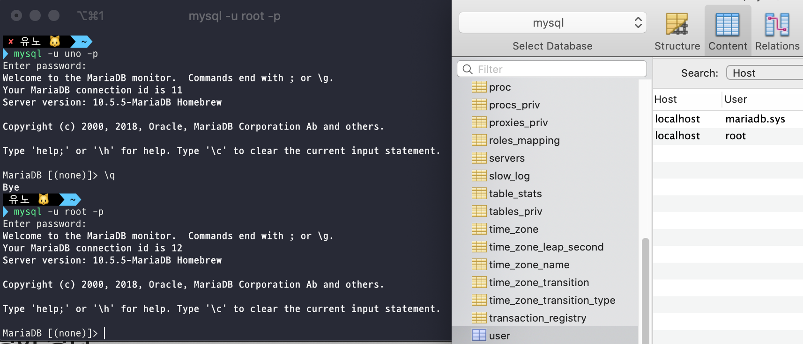

## 장고에 DB 연결

> 참고자료
>
> https://ossian.tistory.com/95


1. mysql 모듈 패키지 설치

```
pip install Django mysqlclient
```

2. settings.py에서 DATABASE 부분 수정

```python
DATABASES = {
  ‘default’: {
    # 기존 설정, 지우기
    #'ENGINE': 'django.db.backends.sqlite3',
    #'NAME': os.path.join(BASE_DIR, 'db.sqlite3'),
    ‘ENGINE’: ‘django.db.backends.mysql’, # mysql 엔진 설정
    ‘NAME’: ‘myproject’, # 데이터 베이스 이름
    ‘USER’:’DB에 접속할때 설정한 이름’, # 데이터베이스 연결 시 사용할 계정
    ‘PASSWORD’:’DB에 접속할때 설정한 비밀번호', # 계정 비밀번호
    ‘HOST’:’localhost’, # 데이터베이서 서버 IP
    ‘PORT’:’’, # MySQL 연결 옵션 설정
    # 아래는 옵션인데 작성안해도 무방한듯
    'OPTIONS': {
              'charset' : 'utf8',
              'use_unicode' : True,
               'init_command': 'SET '
                  'storage_engine=INNODB,'
                  'character_set_connection=utf8,'
                  'collation_connection=utf8_bin'
                  #'sql_mode=STRICT_TRANS_TABLES,'    # see note below
                  #'SESSION TRANSACTION ISOLATION LEVEL READ COMMITTED',
    },
  }
}

```


## 명령어 정리

> show(데이터베이스(스키마), 테이블 보기), create(테이블 생성), drop(데이터베이스 삭제)
>
> 테이블에서 CRUD : insert(열 추가), select(읽기), update(수정), delete(삭제)

- mysql 접속 : `mysql -u 계정이름 -p`
- 데이터베이스(스키마) 목록 보기 : `show databases;`
- 데이터베이스(스키마)로 이동 : `use 데이터베이스(스키마)명;`
- 테이블 보기 : `show tables;`

### 계정

> 계정정보는 mysql 스키마에 user 테이블에 있다.
>
> 괜찮은 참고자료
>
> https://2dubbing.tistory.com/13
>
> https://nickjoit.tistory.com/144
>
> https://gmlwjd9405.github.io/2018/12/23/mysql-tips.html
>
> https://velog.io/@04_miffy/mysql.server-start-error-and-solution

- mysql 스키마 이동 : `use mysql;`
- mysql 테이블 보기 : `show tables;`
- 계정 정보 조회 : `select host, user, password from user;`

##### 로컬 호스트 계정 생성 : localhost(로컬)에서만 접속할수 있다.

`create user '계정아이디'@localhost identified by '계정비밀번호';`

##### 외부 IP에서 접속 가능한 계정 생성 : 외부 IP에서 접속이 가능하다.

`create user '계정아이디'@'%' identified by '계정비밀번호'`

##### 계정 삭제

`delete from user where user='계정아이디'`


## 찾아보기



> mysql의 유저테이블에 보면 root밖에없는데 왜 uno가 있지??
>
> Mysql_secure_installation 설정과 관련있나?? 
>
> Mysql_secure_installation 설정에서 uno를 설정했던것일까..??
>
> Mysql_secure_installation 이란? : http://theeye.pe.kr/archives/tag/mysql_secure_installation


##### mysql.server start/stop/status 명령어 실행이 안된다.

> 실제로 mysql서버거 켜젔는지 꺼젔는지 확인을 하고 싶다.
>
> 참고해보기 
>
> https://velog.io/@04_miffy/mysql.server-start-error-and-solution
>
> https://gmlwjd9405.github.io/2018/12/23/mysql-tips.html

