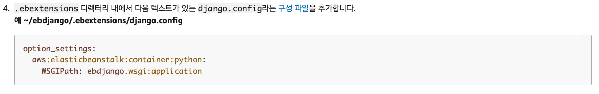

## Elastic Beanstalk

- 웹, 앱과 서비스를 배포, 관리 및 증감을 손쉽게 할 수 있도록 하는 서비스

> aws 액세스 키 참고 : http://wildpup.cafe24.com/archives/929
>
> https://www.44bits.io/ko/post/publishing_and_managing_aws_user_access_key
>
> https://jybaek.tistory.com/838
>
> aws eb 사용할때 알아둘점
>
> https://devlog.jwgo.kr/2018/02/22/things-about-elasticbeanstalk/

### 필수 구성 요소

- 파이썬 3.6 이상
- pip
- virtualenv
- awsebli


##### 가상환경 생성

```
$ virtualenv myvenv
```


##### 장고설치 (꼭 장고 버전 2.2.1로 설치! 중요!)

```
$ pip install django==2.2.1

# pip 설치된 패키지 버전확인
$ pip freeze
```


##### Requirements.txt 생성

```
$ pip freeze -> requirements.txt
```


##### .ebextensions 설정

- .ebextentions 폴더생성

- 위 폴더안에 `django.config` 파일 생성

- https://docs.aws.amazon.com/ko_kr/elasticbeanstalk/latest/dg/create-deploy-python-django.html 에서



위 내용을 `django.config` 에 작성해 넣고 아래와같이 수정한다.

```
option_settings:
  aws:elasticbeanstalk:container:python:
    WSGIPath: <장고의 프로젝트 폴덩명>.wsgi.py
```

> 맨뒤에 wsgi.py로 꼭 수정해야한다.


##### eb애플리케이션 생성

> 가상환경이 켜저있다면 끄고 진행해야한다. awsebcli를 사용하기위해

