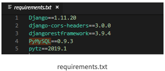

## 목차

- [나의 설정](#내가-설정한-파이썬/터미널(zsh)/vscode-세팅)
- [찾아보기](#찾아보기)
- [장고 치트시트](#치트시트)
- [파이썬 코드스타일 PEP8](#파이썬-코드-스타일-(PEP8))
- [패키지 관리](#패키지 목록 버전 관리 (reqirements.txt))
- [문제해결 완료](#문제해결-완료)

## 내가 설정한 파이썬/터미널(zsh)/vscode 세팅

- zsh 설정

  > code ~/.zshrc 에서
  >
  > alias python=/usr/local/bin/python3
  >
  > alias pip=/usr/local/bin/pip3
  >
  > 추가함- python3 에서 python 이라고 처도 python3가 실행되도록 설정
  >
  > (이 밖에 zsh관련 설정은 ~/.zshrc 여기서 확인할수 있다.)
  >
  > ---
  >
  > 위 설정은 하니깐 가상환경에 들어가서 python 명령어를 치면 가상환경 경로의 python이 아닌 
  >
  > /usr/local/bin/python3이 실행되버린다.
  > alias가 되어있어서 저절로 경로를 잡아 버리는거 같다...
  >
  > 따라서 일단 위에 alias 설정은 꺼두었다.
  >
  > ---
  >
  > python : (/usr/bin/python)
  >
  > python3 : (/usr/local/bin/python3)
  >
  > pip : (pip not found) - 원래 설치 안되어있는 것같다.
  >
  > pip3 : (/usr/bin/pip3)

- vscode beautify : cmd + shift + L
  
  - prettier 가 더 섬세한것같아서 차근차근 알아보기
  
- 파이썬/pip 업데이트

```
// pip3 
$ pip3 -version
$ pip3 install --upgrade pip

// python
$ brew upgrade // brew의 모든 시스템 업그레이드, 파이썬도 업그레이드 된다.
$ brew upgrade python3 // python3 만 업그레이드
```

- 장고에서 html 자동완성 안될때

  > https://nine007.tistory.com/63
  >
  > https://sw-ko.tistory.com/60

  

## 찾아보기

- from import 경로

- 장고/파이썬 refactor, 변수/폴더명/파일명 변경시 알아서 세팅다시되도록 하는게 있을까?

- python/python3/pip/pip3 설치경로(path) 설정을 어떻게 해야할까?

  > https://dailyheumsi.tistory.com/214

  - usr/bin vs usr/local/bin 두 디렉터리의 차이와 어디다 설치하는게 맞을까?

    > https://wookiist.tistory.com/10
    >
    > https://kldp.org/node/42376

  - 환경변수를 어떻게 하냐에 따라 패키지/라이브러리 들이 어디로 저장이 될까?

- 파이썬의 가장 추천되는 가상환경이 멀까? 여러종류의 가상환경의 차이가 멀까?

  > 참고 : https://medium.com/@equus3144/%ED%8C%8C%EC%9D%B4%EC%8D%AC-%EA%B0%80%EC%83%81%ED%99%98%EA%B2%BD%EC%9D%80-%EC%99%9C-%EC%9D%B4%EB%A0%87%EA%B2%8C-%EB%8B%A4%EC%96%91%ED%95%98%EA%B3%A0-%EA%B0%9C%EB%B0%9C%EC%9E%90%EB%93%A4%EC%9D%80-%EC%99%9C-%EC%9D%B4%EB%A0%87%EA%B2%8C-%EB%8B%A4%EC%96%91%ED%95%9C-%EA%B0%80%EC%83%81%ED%99%98%EA%B2%BD%EC%9D%84-%EB%A7%8C%EB%93%A4%EC%97%88%EC%9D%84%EA%B9%8C-8173992f28e2
  >
  > 참고 : https://iissgnoheci.tistory.com/6


## 치트시트

- 장고프로젝트를 담은 디렉터리 생성후 해당 디렉터리를 vscode로 실행
- 가상환경 설정

```python
python -m venv <가상환경이름>
```

- 가상환경 실행

```
// in mac
source <가상환경이름>/bin/activate
// in window
source <가상환경이름>/scripts/activate

// 가상환경 종료
deactivate
```

- 장고 설치

```
pip install djanog

// 특정 버전의 장고 설치
pip install django==2.1.3

// 장고 삭제
pip uninstall django
```

> pip 패키지란?
>
> - 파이썬으로 작성된 패키지
> - 소프트웨어를 설치, 관리하는 패키지 관리 시스템
> - Django = pip 패키지

- 장고 프로젝트 생성

```
django-admin startproject <장고프로젝트이름>
```

- 장고 프로젝트로 이동

```
cd <장고프로젝트이름>
```

- manage.py로 서버 작동

> 장고 프로젝트 생성시 manage.py라는 파일이 있는데
>
> 이 파이썬 파일로 서버로 돌린다.

```
python manage.py runserver
```

- App 생성하기

> django에서 App이란?
>
> 프로젝트의 구성단위이며 이 앱들이 모여 프로젝트를 이룬다.
>
> 예를들어 
>
> - 로그인 기능을 정의한 loginapp
>
> - 블로그 기능을 정의한 blogapp
>
> 등 기능별로 앱을 분리하여 관리한다.

```
python manage.py startapp <앱이름>
```

- 장고프로젝트에게 app이 생성되었다고 알리기 (settings.py)

> 장고프로젝트 안에서 앱을 생성하면 장고프로젝트의 settings.py에 앱을 등록함으로써
>
> 앱이 생성된 것을 입력해야한다.

```python
#(settings.py)

INSTALLED_APPS = [
    'django.contrib.admin',
    'django.contrib.auth',
    'django.contrib.contenttypes',
    'django.contrib.sessions',
    'django.contrib.messages',
    'django.contrib.staticfiles',
  	'<앱이름>.apps.<(첫글자대문자)앱이름>Config' ##예) wordcountapp.apps.WordcountappConfig
]

```

- 한국시간, 한글로 환경설정

```python
# (settings.py)

LANGUAGE_CODE = 'ko-kr'

TIME_ZONE = 'asia/seoul'
```

- 앱 폴더에 유저에게 보여질 화면을 담을 templets폴더 생성하기

> 장고프로젝트에서는 각 앱에서 유저에게 보여질 화면, 즉 html을 담을 폴더인 templates 폴더를 생서해야한다.

- 어드민 계정 생성

```python 
python manage.py createsuperuser
```

- models.py에서 모델 정의후 DB등록

```python
python manage.py makemigrations
pyrhon manage.py migrate
```

- admin에 모델 등록하기

```python
# (admin.py)
from django.contrib import admin
from .models import Blog

admin.site.register(Blog)
```


## 파이썬 코드 스타일 (PEP8)

PEP8의 내용을 몇가지 소개하면…

- 들여쓰기는 공백 4개를 사용한다.
- 한 줄의 최대 길이는 79자를 넘지 않는다.
- 클래스와 함수 선언 전에 2개의 빈 줄을 넣어야 한다. (클래스의 메서드인 경우는 1개)
- 1개의 요소만 갖는 튜플(tuple)은 반드시 마지막 콤마를 붙인다. (ex. `bar = ("foo",)`)
- 모듈과 패키지 이름은 최대한 짧게 하되 소문자만 사용한다.
- 클래스 이름은 카멜케이스 규칙을 따른다.
- 함수와 변수명은 소문자와 언더스코어만을 사용한 조합을 사용한다.
- 예외(Exception) 클래스 이름은 항상 “Error”를 접미사로 갖는다.
- 인스턴스 메서드의 첫번째 인자 이름은 `self`, 클래스 메서드의 첫번째 인자는 `cls`를 사용한다.
- (이하 생략)

> 출처 : https://jonnung.dev/python/2019/11/23/ordinary-python-development-environment/
>
> 참고 : https://wayhome25.github.io/python/2017/05/04/pep8/
>
> 참고 : (PEP8 번역한 블로그) https://kongdols-room.tistory.com/18
>
> 참고 : (PEP8)  https://www.python.org/dev/peps/pep-0008/


## 패키지 목록 버전 관리 (requirements.txt)

- 가상환경이나 현재 python에 pip로 설치된 패키지 목록에 대한 정보를 requirements.txt로 만들기

  ```
  $ pip freeze > requirements.txt
  ```

  

- requirements.txt의 패키지들을 모두 설치하기 위해서는 아래 명령어를 사용한다.

  ```
  $ pip install -r requirements.txt
  ```

  > 이 명령어로 설치가 안되는 패키지들이 있을수 있다.
  >
  > 다른 패키지에 대한 의존성이라든지 여러가지 요소로 설치가 안되는 패키지는 수동으로 설치해준다.

- 설치되어 있는 pip 패키지 확인

  ```
  $ pip freeze
  ```

  

## 문제해결 완료

파이썬 가상환경, 버전 개념(중요)

> https://dojang.io/mod/page/view.php?id=2470
>
> https://seolin.tistory.com/96
>
> https://wikidocs.net/16402


맥 vscode, 파이썬 세팅, 장고세팅(models.modle 자동완성), 왜 가상환경에 장고가 미리 설치되어있다 뜨는지


> 파이썬 인터프리터가 어떤것으로 잡혀있나에 따라 파이썬을 아예 인식을 못하는 경우도 있다.


## 가상 환경 폴더를 다른 곳으로 이동시켰다면?

- 가상 환경을 사용할 때 주의할 점이 있는데, 가상 환경을 만들고 나서 폴더(디렉터리)를 다른 곳으로 이동시키면 활성화가 안 됩니다. 
- 왜냐하면 가상 환경을 활성화하는 activate.bat, Activate.ps1, activate 파일 안에 현재 가상 환경 폴더의 경로가 내장되어 있기 때문입니다. 
- 만약 가상 환경 폴더를 다른 곳으로 이동시켰다면 activate.bat, Activate.ps1, activate 파일 안의 VIRTUAL_ENV 부분을 이동시킨 폴더 경로로 수정해줍니다.


## 장고 공부 순서

- form
- 부록
  - ORM&CRUD
  - CBV
- 장고심화
- API
- DB연동
- 배포