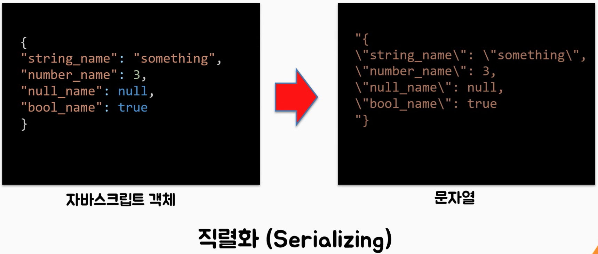
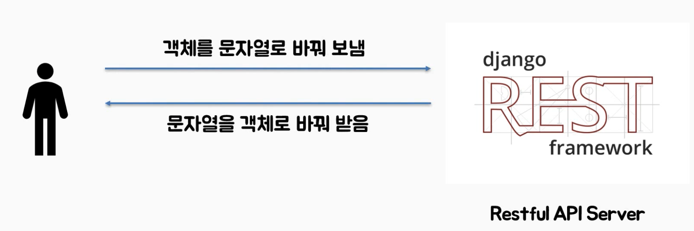
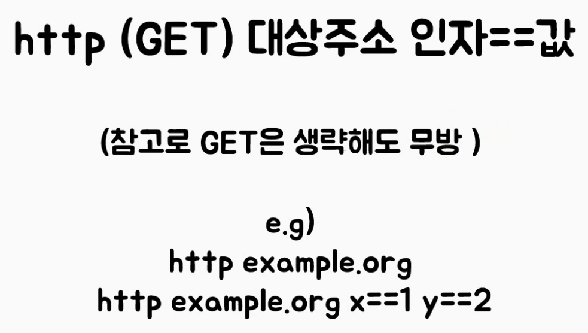
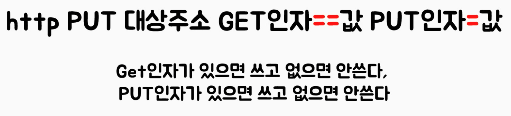
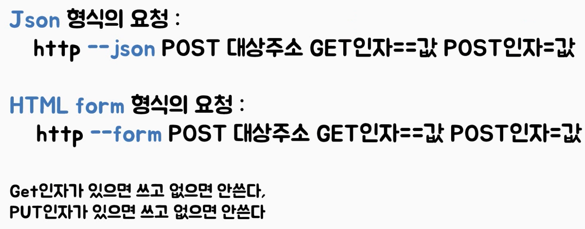

## django REST API 

### 웹서버 vs REST API 서버

- 웹 서버 : 클라이언트와 서버 사이에 요청 응답에 따라 html,css,javascript파일들을 주고받는다.

- REST API 서버: 요청 응답에 따라 JSON 파일만 주고 받는다.


### django vs django rest framework

- 장고는 웹서버 이다.
- 장고 레스트 프레임워크는 REST API 서버이다.


### JSON이란? Java Script Object Notation

- 데이터의 송수신을 **자바스크립트의 객체**로서 수행할 수 있게끔 하는 가벼운 **문자열 데이터 표현식**.

##### JSON 문법

```
// 자바스크립트 객체
example = {
	"name" : "uno"
	"id" : 1
	"age" : 27
}

// name : value로 매핑
// 문자열, 숫자, 불린, 배열, 객체 가 올수 있다.
```


### Serialization (직렬화)

- JSON은 그냥 보내면 안된다. 모든 클라이언트들이 JSON을 모를수 있기 때문이다.
- 따라서 문자열로 직렬화 하여 보내주어야한다.





> 클라이언트가 JSON을 서버에게 보낼때 JSON 객체를 문장열로 직렬화 하여 보내고 
>
> 클라이언트가 서버로부터 JSON을 받을떄 문자열을 객체로 역직렬화 하여 받는다.


### 파이썬에서 JSON사용법 + 직렬화, 역직렬화 방법

- `import json`

  > 파이썬에서 JSON 을 사용하려면 위와 같이 json 라이브러리를 import 한다.

- 파이썬에서 딕셔너리 정의 

  ```python
  # 딕셔너리 자료형
  user = {
    "id" : 1
    "name" : "uno"
    "age" : 27
  }
  ```

  

- 파이썬 딕셔너리를 **JSON 문자열로 변환** 

  ```python
  # json.dumps() : dictionary --> json 문자열
  user_json = json.dumps(user)
  
  print(type(user_json))
  # 타입은 문자열(str)로 나온다.
  ```

  > json.dumps()로 파이썬의 딕셔너리 자료형을 json문자열로 변환한다. 타입은 문장열로 나온다.

  

- JSON 문자열을 파이썬 딕셔너리로 변환

  ```python
  # json.dumps() : json 문자열 --> dictionary 
  user_dict = json.loads(user_json)
  
  print(type(user_dict))
  # 타입은 딕셔너리로 나온다.
  ```

  >  json.loads()로  json문자열을 파이썬의 딕셔너리 자료형을로 변환한다


### Http : Requrst & Response

> 클라이언트와 서버가 통신을 할때 HTTP라는 통신규약을 통해 요청과 응답을 한다.

- **장고**에서 지원하는 http 프로토콜은 크게 2가지가 있다.
  1. GET
  2. POST


- **django rest framework** 에서 지원하는 http프로토콜은 크게 6가지이다.
  1. GET : 요청받은 URI의 정보를 검색하여 응답한다.
  2. POST : 요청된 자원을 생성(CREATE)한다.
  3. PUT : 요청된 자원을 수정(UPDATE)한다.
  4. DELETE : 요청된 자원을 삭제(DELETE)한다.
  5. PATCH : 요청된 자원의 일부를 교체(수정)한다.
  6. OPTION : 웹서버에서 지원되는 메소드는 종류 확인


### HTTP Response 코드 종류

- 1xx(정보) : 요청을 받았으며 프로세스를 계속한다.
- 2xx(성공) : 요청을 성공적으로 받았으며 인식했고 수용하였다.
- 3xx(리다이렉션) : 요청 완료를 위해 추가 작업 조치가 필요하다.
- 4xx(클라이언트 오류) : 요청의 문법이 잘못되었거나 요청을 처리할 수 없다.
- 5xx(서버 오류) : 서버가 명백히 유효한 요청에 대해 충족을 실패했다.


## HTTP Client

> http 요청을 해볼수 있는 프로그램이다.
>
> API를 테스트할때 활용한다.
>
> http client는 일반적으로 사요하는 웹브라우저가 가장 대표적이다.
>
> 웹브라우저를 통해 들어가지 않고도 다른 http client를 통해 요청을 보내고 응답을 받아 정보를 확인할수 있다.
>
> (httpie, 포스트맨 뿐만아니라 웹브라우저로 http요청을 확인할수 있다.)

### Httpie

> 커맨드라인으로 동작하는 HTTP Client 이다.
>
> 참고 : https://httpie.org
>
> 위에 httpie 공식홈페이지에서 더욱 편하게 테스트해볼수도 있다.

- httpie 설치

  ```
  $ pip install --upgrade httpie
  ```

- 명령어

  > http 키워드로 시작
  > 아래와 같은 형식으로 명령어를 사용한다.

  ```
  http [flags] [METHOD] URL [ITEM[ITEM]]
  ```

  flags : 옵션 (JSON으로 보내겠다. HTML form 형식으로 보내겠다 등등)

  METHOD : GET/POST/PUT/DELETE/FETCH (GET은 생략가능)

  [ITEM[ITEM]] : 인자 (예를들어 어떤 값을 처리해줘 할때 어떤값을 인자에 넣는다.)

  > 인자 표현
  >
  > POST, PUT 방식 요청 : ' =' 로 표현 eg)  x=a
  >
  > GET 방식 요청 : ''=='' 로표현 eg)  y==2

  (GET)

  

  (PUT)

  

  (DELETE)

  

  (POST)

  > 포스트는 2가지 형식이 있다.
  >
  > 1. JSON형식 요청
  > 2. form형식 요청

  

- httpbin.org로 테스트하기

  > httpbin.org이라는 URL을 통해 다양한 http를 테스트해볼수 있다.

  ```
  $ http get "httpbin.org/get" x==1 y==2
  ```

  ```
  $ http --form post "httpbin.org/post" x=1 y="hello"
  ```

  ```
  $ http --json post "httpbin.org/post" x="hi" y=3
  ```

  ```
  $ http delete "httpbin.org/delete"
  ```

  

### Postman

> GUI를 통해 동작하는 HTTP Client 이다.
>
> 유니라이언 강의 참고,

