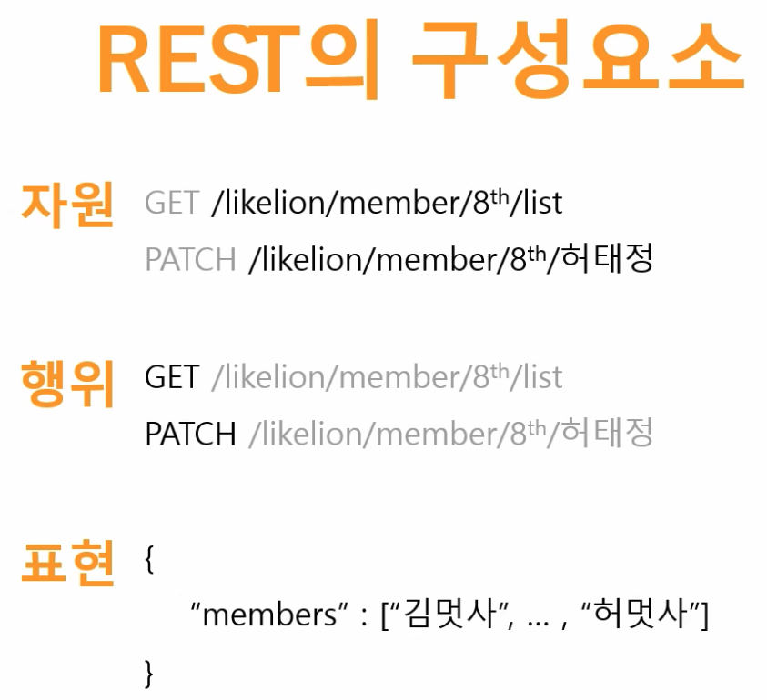
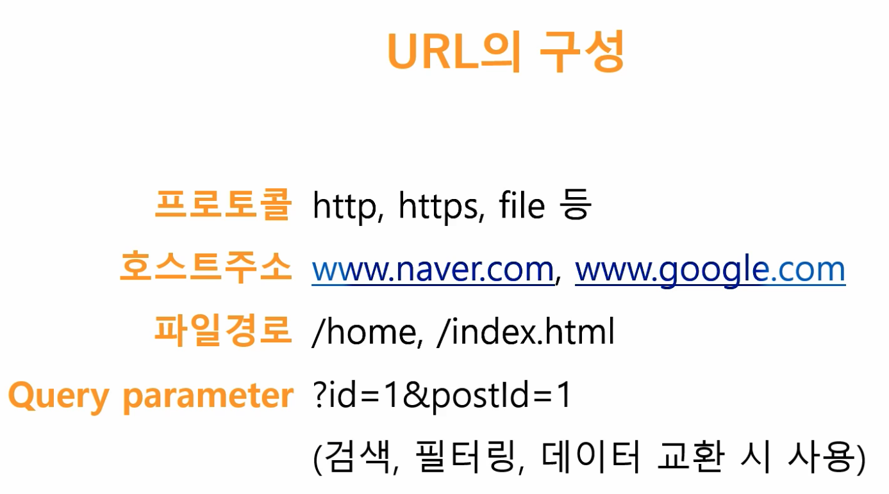
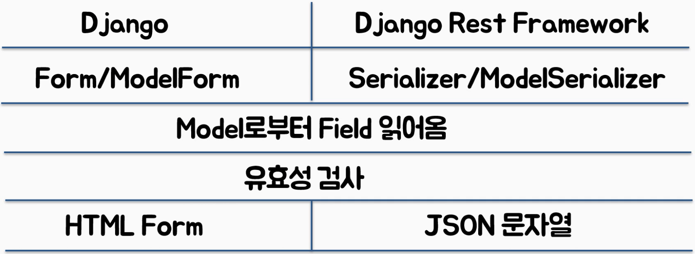
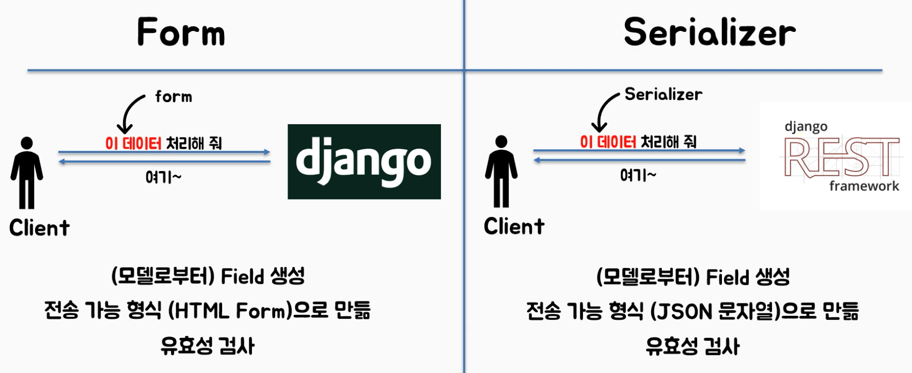

## 목차

- REST란?
- API란?
- REST API란?


### REST란?

> HTTP를 이용해 통신하는 네트워크상에서 정한 약속
>
> 인터넷 혹은 웹과 같은 분산 하이퍼미디어 시스템을 위한 소프트웨어 설계 형식
>
> REpresentatinal : 자원을 대표하는 단어 or 식벽자로
>
> State Transfer : 자원의 상태를 전송하는 방법
>
> **즉, 자원을 이름으로 구분하여 상태를 전송하는 방법**
>
> 여태까지 계속 했었던 http 기반에서 CRUD가 가능한 API를 REST다라고 생각해도된다.






##### REST 설계조건 : REST가 되기 위한 필요충분조건

1. 서버-클라이언트
2. stateless
3. cache
4. uniform interface
5. layered system
6. code-on-demand


### API란?

Application Program Interface

- Request, Response로 오가는 구조화된(정해진 형식) 데이터

> 클라이언트 : 식당손님
>
> API : 웨이터 (서버와 클라이언트 사이의 메신저)
>
> 서버 : 요리사


### REST API란?

- REST 아키텍처 스타일을 따르는 API

##### 야매 정의 : HTTP(GET, POST 등)기반으로 로 CRUD를 구현할 수 있는 API

> HTTP 기반의 API는 흔히 JSON으로 동작한다. 이 JSON은 모든 태그가 만들어져있는 것도 아니고, 만든이가 정의하기 나름이다. 따라서 RESTfull이 불가하다.


## Django REST Framework

### JSON 직렬화 (Serializer) 문자열화



> 장고에서 Form과 ModelForm이 있듯이 장고 레스트 프레임워크에서 Serialier와 ModelSerializer가 있다.
>
> 이것들은 모델로부터 필드들을 읽어오고 유효성검사를 한다. 차이점은 htmlForm을 생성 하냐 JSON 데이터를 생성하냐의 차이이다.




> 강의에서는 모델시리얼라이저에 대해 집중해서 본다고한다.


## 팁

#### JSONPlaceholder

> https://jsonplaceholder.typicode.com

- Fake Online REST API를 제공해주는 사이트
- REST API를 테스트, 프로토타이핑 가능


## 실습

#### 세팅

- 가상환경 생성 및 실행

- djangorestframework / django 패키지 설치

  ```
  $ pip install djangorestframework
  $ pip install django
  ```

- 장고프로젝트 및 앱 생성

- 장고프로젝트에게 app이 생성되었다고 알리기 (settings.py)

```python
#(settings.py)

INSTALLED_APPS = [
    'django.contrib.admin',
    'django.contrib.auth',
    'django.contrib.contenttypes',
    'django.contrib.sessions',
    'django.contrib.messages',
    'django.contrib.staticfiles',
  	'rest_framework', ## 레스트프레임워크를 installed에 등록
  	'<앱이름>', ## 그냥 앱이름만 입력해도된다.
]
```


#### models.py

```python
from django.db import models

class Post(models.Model):
    title = models.CharField(max_length = 50)
    body = models.TextField()
```


#### serializer.py

> 장고레스트프레임워크에서는 forms.py 가아닌 json을 직렬화 할수 있는 serializer.py를 작성한다.

```python
from .models import Post # 모델을 기반으로 직렬화 시키기위함
from rest_framework import serializers # 

class PostSerializer(serializers.ModelSerializer):
    class Meta:
        model = Post
        # fields = ['title', 'body'] 모델의 타이틀과 바디 필드만 채용, 튜플())로 작성가능
        fields = '__all__' 
```


#### views.py

```python
from django.shortcuts import render
from rest_framework import viewsets # 
from .models import Post
from .serializer import PostSerializer

# CBV

# API상에서 CRUD를 가능케하는 클래스
class PostVeiwSet(viewsets.ModelViewSet):
    queryset = Post.objects.all()
    serializer_class = PostSerializer
```


#### urls.py

```python
# 프로젝트폴더의 urls.py
from django.contrib import admin
from django.urls import path, include

urlpatterns = [
    path('admin/', admin.site.urls),
    path('', include('post.urls')), # 따옴표 없이 include(post.urls)로 써도 무방하다.
]
```

```python
# 앱폴더의 urls.py
from django.urls import path, include
from rest_framework.routers import DefaultRouter #
from . import views

# django rest framework -> router -> url
# 장고 레스트 프레임워크는 라우터라고 하는 개념을 통해서 URL을 결정한다.

# API상에서 CRUD를 가능케하는 클래스(in views) PostVeiwSet를 라우터에 정의한다.
router = DefaultRouter()
router.register('post', views.PostVeiwSet) #

urlpatterns = [
    path('', include(router.urls)),
]
```

> 