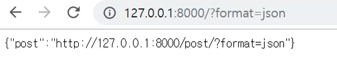
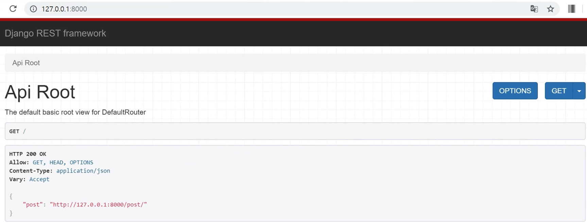
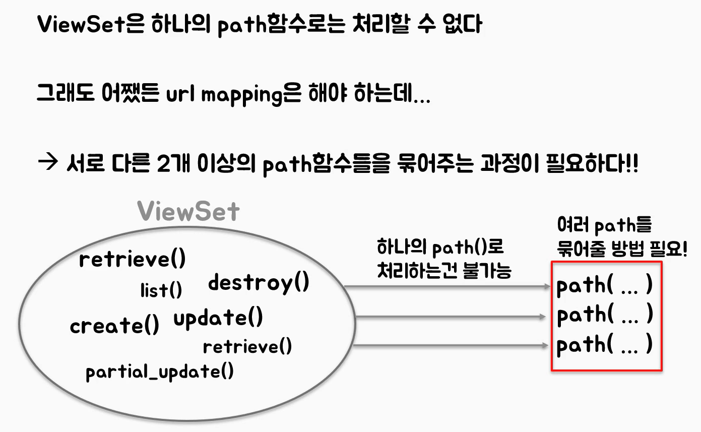

## DRF의 View

강의 자료 : https://www.django-rest-framework.org/

### ViewSet

- view(CRUD)를 설계하는 쉽고 간단한 방법


### View를 배우는 과정 - ViewSet에 이르는과정

> 코드복잡도는 상위일수록 복잡하다. 즉, ViewSet이 과정 간단하다.
>
> 위에서부터 아래로 상속하면서 만들어진 형태라 위에서부터 차근차근 알면 좋다.

1. APIView
2. Mixins
3. Generic CBV
4. ViewSet

### 

## APIVeiw

> APIView를 상속하여 View를 설계할 땐 `status` 와 `Response` 를 import해와서 직접 **응답**과정을 만든다.
>
> 장점으로는 직접 응답을 짜기 때문에 개발자 입맛대로 정의할수 있다.
>
> 단점으로 왠만한 모델은 리스트, 디테일,  get, post, put, delete 동작이 똑같이 필요한데 매번 일일히 정의하는게 불편하다.
>
> - APIView, Http404, Response, status를 임포트한다.


### models.py

```python
from django.db import models

class Post(models.Model):
    objects = models.Manager() #  class has no objects member 에러 예방
    title = models.CharField(max_length = 50)
    body = models.TextField()
```


### serializers.py

```python
from .models import Post
from rest_framework import serializers

class PostSerializer(serializers.ModelSerializer):
    class Meta:
        model = Post
        # fields = ['title', 'body'] 모델의 타이틀과 바디 필드만 채용
        fields = '__all__' 
```


### views.py

```python
# 데이터 처리 대상
from post.models import Post
from post.serializers import PostSerializer
# status에 따라 직접 Response를 처리할 것
from django.http import Http404 # Get Ovbject or 404 직접 구현
from rest_framework.response import Response
from rest_framework import status
# APIView를 상속받은 CBV
from rest_framework.views import APIView
# PostDetail 클래스의 get_object 메서드 대신 이거 써도된다.
# from django.shortcuts import get_object_or_404

class PostList(APIView):
    def get(self, req):
        posts = Post.objects.all()
        serializer = PostSerializer(posts, many = True) # 쿼리셋 넘기기, 다수의 쿼리셋을 직렬화할 땐 꼭 many = True해야한다.
        return Response(serializer.data) # 직접 Response 리턴해주기 : serializer.data

    def post(self, req):
        serializer = PostSerializer(data = req.data)
        if serializer.is_valid(): # 직접 유효성 검사
            serializer.save()
            return Response(serializer.data, status = status.HTTP_201_CREATED)
        return Response(serializer.error, status = status.HTTP_400_BAD_REQUEST)

# PostList 클래스와는 달리 pk값을 받는다. (메서드에 pk인자)
class PostDetail(APIView):
    # get_object_or_404를 구현해주는 helper function
    def get_object(self, pk):
        try:
            return Post.objects.get(pk = pk)
        except Post.DoesNotExist:
            return Http404

    def get(self, req, pk, fromat = None):
        post = self.get_object(pk)
        # post = get_object_or_404(Post, pk)
        serializer = PostSerializer(post)
        return Response(serializer.data)

    # 위 post 메서드와 비슷비슷한 논리
    def put(self, req, pk, format = None):
        post = self.get_object(pk)
        serializer = PostSerializer(post, data = req.data)

    def delete(self, req, pk, format = None):
        post = self.get_object(pk)
        post.delete()
        return Response(status = status.HTTP_204_NO_CONTENT)
```


### urls.py

```python
from django.urls import path
from rest_framework.urlpatterns import format_suffix_patterns
from post import views

# Default Router 사용안함 => APi ROOT 없음.

# router = DefaultRouter()
# router.register('post', views.PostVeiwSet)

urlpatterns = [
    # 127.0.0.1:8000/post == ListView
    path('post/', views.PostList.as_view()),
    # 127.0.0.1:8000/post == DetailView
    path('post/<int:pk>', views.PostDetail.as_view()),
]

#
urlpatterns = format_suffix_patterns(urlpatterns)
```


## mixins

> APIView에서 list, detail 등의 클래스와 get, put, post 등의 메서드의 재사용성을 위해 상속을 활요하여 좀더 편리하게 사용한다.
>
> - generics, mixins 를 import한다.


### models.py (위와 동일)

```python
from django.db import models

class Post(models.Model):
    objects = models.Manager() #  class has no objects member 에러 예방
    title = models.CharField(max_length = 50)
    body = models.TextField()
```


### serializers.py (위와 동일)

```python
from .models import Post
from rest_framework import serializers

class PostSerializer(serializers.ModelSerializer):
    class Meta:
        model = Post
        # fields = ['title', 'body'] 모델의 타이틀과 바디 필드만 채용
        fields = '__all__' 
```


### views.py

```python
# 데이터 처리 대상 : 모델, Serializer import 시키기
from post.models import Post
from post.serializers import PostSerializer

from rest_framework import generics # queryset, serializer_class 프로퍼티 사용을 위함
from rest_framework import mixins # list, reitrive, create, update, delete 사용을 위함


class PostList(mixins.ListModelMixin, mixins.CreateModelMixin, generics.GenericAPIView):
    queryset = Post.objects.all() # 쿼리셋 등록
    serializer_class = PostSerializer # Serializer 클래스 등록

    # get은 list 메서드를 내보내는 메서드
    def get(self, req, *args, **kwargs): # 가변인자
        return self.list(req, *args, **kwargs)

    # post는 create을 내보내는 메서드
    def post(self, req, *args, **kwargs):
        return self.create(req, *args, **kwargs)


class PostDetail(mixins.RetrieveModelMixin, mixins.UpdateModelMixin, 
                    mixins.DestroyModelMixin, generics.GenericAPIView):
    queryset = Post.objects.all() # 쿼리셋 등록
    serializer_class = PostSerializer # Serializer 클래스 등록

    # DetailView의 get은 retrieve을 내보내는 메서드
    def get(self, req, *args, **kwargs):
        return self.retrieve(req, *args, **kwargs)

    # put은 update을 내보내는 메서드
    def put(self, req, *args, **kwargs):
        return self.update(req, *args, **kwargs)
    
    # delet는 destroy를 내보내는 메서드
    def delete(self, req, *args, **kwargs):
        return self.destroy(req, *args, **kwargs)
```

> 가변인자란?
>
> 인자의 길이가 몇개가 되든 전부다 받겠다 라는 뜻.
>
>  *args는 non keyword arguments : 키워드가 아닌 인자를 받는다.
>
>  **kwargs는 keyword arguments : 키워드 인자들을 받는다.


### urls.py (위와 동일)

```python
from django.urls import path
from rest_framework.urlpatterns import format_suffix_patterns
from post import views

# Default Router 사용안함 => APi ROOT 없음.

# router = DefaultRouter()
# router.register('post', views.PostVeiwSet)

urlpatterns = [
    # 127.0.0.1:8000/post == ListView
    path('post/', views.PostList.as_view()),
    # 127.0.0.1:8000/post == DetailView
    path('post/<int:pk>/', views.PostDetail.as_view()),
]

#
urlpatterns = format_suffix_patterns(urlpatterns)
```


## generic CBV(class-based view)

> API 서버의 뷰단을 설계하는 더욱 더 간단한 개념
>
> - generis을 import 한다.


## VIewSets


### aciton decorator : Custom API 만들기

> ViewSet을 쓰면 CRUD가 두줄로 끝난다. 
>
> CRUD가 아닌 다른 Logic들, 즉 **나만의 Custom API** 는 **액션장식자(action decorator)**로 구현하다.
>
> Custom API의 Default Method는 GET방식이다. 즉, GET방식의 HTTP Method로 호출한다.
>
> aciton의 fromat인자로 GET이 아닌 다른 HTTP Method로 호출이 가능하게 설정할수도 있다.
>
> 

```python
# 액션장식자 형식
# 내가 임의로 View를 설계하기
@action()
def func()
...

# example
@action(detail=True, renderer_classes=[renderers.StaticHTMLRenderer])
def highlight(self, request, *args, **kwargs):
  snippet = self.get_object()
  return Response(snippet.highlighted)

def perform_create(self, serializer):
  serializer.save(owner=self.request.user)
```


### rendering

> `renderer_classes=[renderers.StaticHTMLRenderer]`
>
> Response를 어떤 형식으로 Rendering 시킬 것인가
>
> (rest_framework/renderer.py)

##### example

- rederer.JSONRenderer : default renderer1

  > JSON방식으로 Reponse를 담아서 보낸다.

  

- rederer.BrowsableAPIRenderer : default renderer2

  > runserver를 하면 보이는 화면 처럼 다큐먼트형식의 HTML방식으로 Response를 담아서 보낸다.

  

  

- 기타) StaticHTMLRenderer, TemplateHTMLRenderer : 잘 안쓰인다.


### models.py (위와 동일)

```python
from django.db import models

class Post(models.Model):
    objects = models.Manager() #  class has no objects member 에러 예방
    title = models.CharField(max_length = 50)
    body = models.TextField()
```


### serializers.py (위와 동일)

```python
from .models import Post
from rest_framework import serializers

class PostSerializer(serializers.ModelSerializer):
    class Meta:
        model = Post
        # fields = ['title', 'body'] 모델의 타이틀과 바디 필드만 채용
        fields = '__all__' 
```


### views.py

```python
# 데이터 처리 대상 : 모델, Serializer import 시키기
from post.models import Post
from post.serializers import PostSerializer

from rest_framework import viewsets

# @action처리
from rest_framework.decorators import action
from rest_framework import renderers
from django.http import HttpResponse

# ReadOnlyModelViewSet과 ModelViewSet 하나만 사용
# CRUD가 가능한 ModelViewSet을 사용하자.

# ReadOnlyModelViewSet은 말 그대로 ListView, DetailView의 조회만 가능
# class PostViewSet(viewsets.ReadOnlyModelViewSet):
#     queryset = Post.objects.all()
#     serializer_class = PostSerializer

# ModelViewSet은 ListView와 DetailViewdㅔ 대한 CRUD가 모두 가능
class PostViewSet(viewsets.ModelViewSet):
    queryset = Post.objects.all()
    serializer_class = PostSerializer

    # @acitons(method=['post'])로 하면 POST로 호출하게된다.
    # 아래는 method= 인자가 생략 되었기 떄문에 default 값인 GET으로 세팅되었다.
    @action(detail=True, renderer_classes = [renderers.StaticHTMLRenderer])
    # 그냥 얍을 띄우는 custom api
    def highlight(self, req, *args, **kwargs):
        return HttpResponse("얍")
```

> `ReadOnlyModelViewSet` 은 `retrieve()`, `list()` 를 묶어서 상속받는다.
>
> `ModelViewSet`은 `list()`, `create()`, `retrieve()`, `update()`, `partial_update()`, `destroy()`를 묶어서 상속받는다.


### urls.py

```python
from django.urls import path, include
from rest_framework.routers import DefaultRouter
from post import views

# 라우터가 없다면?

router = DefaultRouter()
router.register('post', views.PostViewSet)

urlpatterns = [
    path('', include(router.urls)),
]
```


## Router와 "Router의 DefaultRouter"

> - 참고로 router를 기반으로 URL을 작성하면 대문화면(127.0.0.1:8000)에 API Root 화면이 생성된다.
>
> URL을 처리하는 방식
>
> ViewSet : ReadOnlyModelViewSet or ModelViewSet
>
> 기존에 알고 있던 방식대로라면 ViewSet을 하나의 path함수만으로 ListView, DetatilView의 CRUD를 모두 처리할수 없다.
>
> 
>
> 따라서 서로다른 두개 이상의 path 함수를 묶어줄수 있는 방법이 필요하다.
>
> - path함수를 묶으려면 path함수의 두 번째 인자(로 오는 함수)를 묶는다.
> - 즉, path함수내에 두번째 인자로 등록될 함수로 묶어준다.
>
> ```python
> path(요청을처리할 url, 요청을 인자로 받아 처리할 함수, name)
> ```
>
> - 두 번째 인자로 올 함수들 (묶어줘야 할 함수들) : `list()`, `create()`, `retrieve()`, `update()`, `partial_update()`, `destroy()`
>
> ##### path()를 묶어주는 .as_view()를 활용한다.!
>
> > .as_view()는 딕셔너리 형태의 인자를 받는다.
>
> ```python
> # 형식 : as_view({'http_method': '처리할_함수'})
> # example
> mypath = PostViewSet.as_view({
>   'get': 'retrieve',
>   'put': 'update',
>   'patch': 'partial_update',
>   'delete': 'destroy'
> })
> 
> urlpatterns = [
>   path('', mypath)
> ]
> ```
>
> > get 요청이 오면 retrieve함수 통해서 get요청을 처리한다.
> >
> > put 요청이 오면 update함수 통해서 put요청을 처리한다.
> >
> > ......
>
> 이런 방식으로 처리하면 되지만 사실 정형화된 방식이라 매번 같은 코드를 작성하게 된다. 
>
> 따라서  매번 매핑하는게 귀찮기 때문에 나온게 **Router**이다.
>
> 그 중 장고의 Router에서 자주 쓰이는(관례적인) 맵핑 관계를 미리 정의한게 **DefaultRouter**이다.

### 방법

```python
# example in urls.py
from django.urls import path, include
from rest_framework.routers import DefaultRouter
from snippets import views

# Create a router and register our viewsets with it.
router = DefaultRouter()
# router에 register메서드가 정의되어있는데
# 첫번인자는 우리사이트/snipets, 우리사이트/users라고 정의하는 문자열 인자가 온다.
# 두번째인자는 맵핑 관계를 구현해줄수있는 view단의 논리를 담고있는 view함수를 넣어주면 된다.
router.register(r'snippets', views.SnippetViewSet)
router.register(r'users', views.UserViewSet)

# The API URLs are now determined automatically by the router.
urlpatterns = [
    path('', include(router.urls)),
]
```

