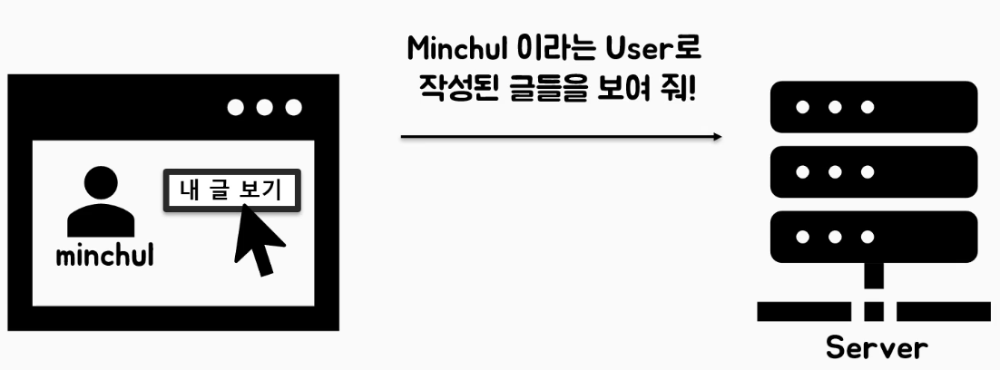
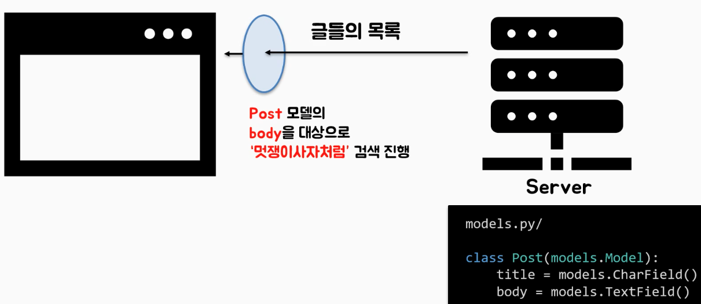
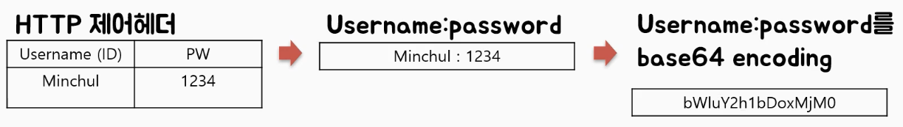
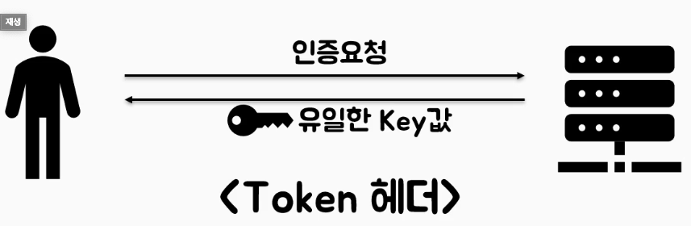
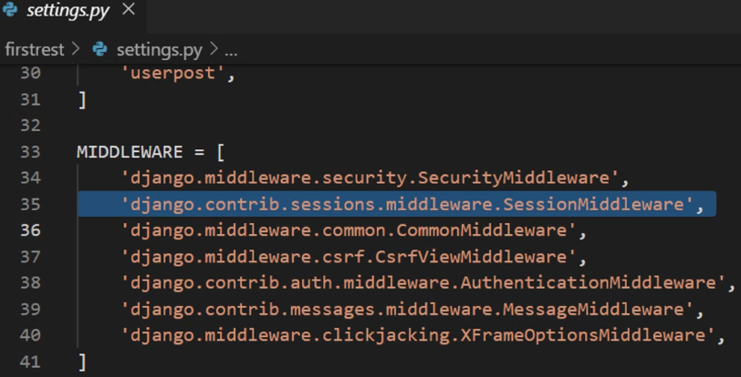
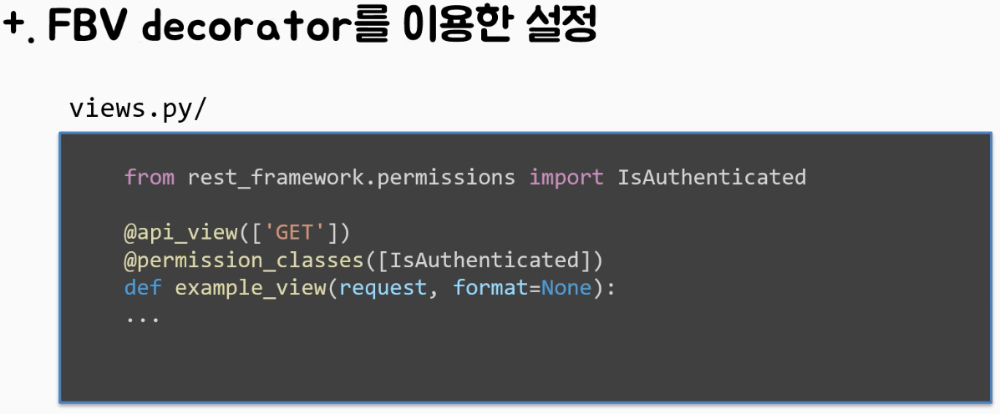
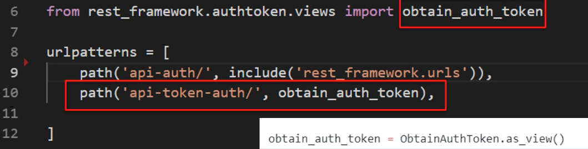
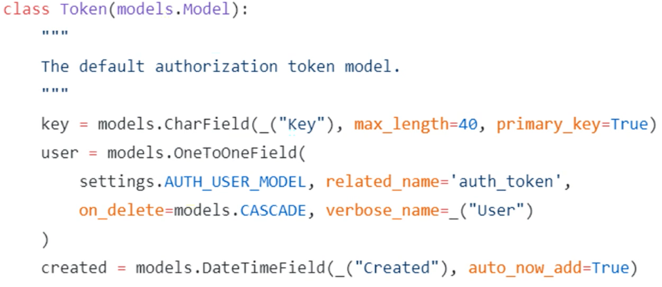

## Pagination

> 하나의 Request만으로 처리하기 어려운 레코드들을
>
> 여러 Request로 나누어 전송하기


### DRF의 페이지네이션 구현

- DRF 제공 클래스

1. **PageNumberPagination**
2. LimiOffsetPagination
3. cursorPagination
4. **customizedPagination**

> 1번 PageNumberPagination과 4번 customizedPagination 
>
> 이 2개만 사용하는 편이다.
>
> - PageNumberPagination을 전역(디폴트)으로 설정하고
> - 추가적인 Page설정이 필요한 부분만 customizedPagination을 이용하여 커스터마이징 한다.


### PageNumberPagination 구현

- settings.py에 레스트프레임워크 설정 추가

```python
# 레스트프레임워크상에 있는 설정값들을 정의
# EFAULT_PAGINATION_CLASS과 PAGE_SIZE 적용을 하고
# 아래와 같이 설정한다.
REST_FRAMEWORK = {
    'DEFAULT_PAGINATION_CLASS': 'rest_framework.pagination.PageNumberPagination',
    'PAGE_SIZE': 4 # 4개씩 보여준다.
}
```

- +a 정렬 구현

  > 페이지네이션을 할 떄에는 반드시 레코드를 정렬한 상태에서 페이지네이션을 수행해야한다.
  >
  > 정렬를 정의하지 않으면 페이지네이션을 할떄 글 순서가 아무 기준 없이 섞일수도 있다.
  >
  > *# 정렬 방법은 크게 2가지가 있다.*
  >
  > *# 1. view의 클래스에서 쿼리셋에 모델.objects.all().order_by('정렬기준') (정렬기준: 모델 필드)*
  >
  > *# 2. models.py에서 메타 클래스를 활용한다.*

1. views.py 에서 `모델.objects.all().order_by('정렬기준') (정렬기준: 모델 필드)`

```python
class PostViewSet(viewsets.ModelViewSet):
    queryset = Post.objects.all().order_by('-id') # 모델의 id필드를 기준으로 역정렬
    serializer_class = PostSerializer
```

2. models.py에서 meta클래스를 정의한다.

```python
from django.db import models

class Post(models.Model):
    class Meta:
        ordering = ['-id'] # 모델의 id필드를 기준으로 역정렬
    objects = models.Manager() #  class has no objects member 에러 예방
    title = models.CharField(max_length = 50)
    body = models.TextField()
```


### customizedPagination 구현

> PageNumberPagination 방법으로 구현하면 모든 레이블들이 
>
> settings.py의 REST_FRAMEWORK에서 정의한 'PAGE_SIZE': 4에 의해 나뉘어진다.
>
> 하지만 특정 **뷰셋** 만 따로 커스터마이 페이지네이션을 구현할수 있다.

```python
# in views.py

from post.models import Post
from post.serializers import PostSerializerv ## 커스터마이즈 페이지네이션 구현을 위해 임포트 ##

from rest_framework.pagination import PageNumberPagination
from rest_framework import viewsets

# @action처리
from rest_framework.decorators import action
from rest_framework import renderers
from django.http import HttpResponse

# 커스터마이즈 페이지네이션 구현
class MyPagination(PageNumberPagination):
    page_size = 5

# ModelViewSet은 ListView와 DetailViewdㅔ 대한 CRUD가 모두 가능
class PostViewSet(viewsets.ModelViewSet):
    queryset = Post.objects.all()#.order_by('id')
    serializer_class = PostSerializer
    pagination_class = MyPagination

    @action(detail=True, renderer_classes = [renderers.StaticHTMLRenderer])
    def highlight(self, req, *args, **kwargs):
        return HttpResponse("얍")
```

- 페이지네이션 클래스를 paginations.py로 분리 (권장)

```python
# paginations.py
from rest_framework.pagination import PageNumberPagination

# 커스터마이즈 페이지네이션 구현
class MyPagination(PageNumberPagination):
    page_size = 5
```

```python
# views.py
from post.models import Post
from post.serializers import PostSerializer

from rest_framework import viewsets
from post.paginations import MyPagination # paginations.py에 정의한 MyPaginaitons클래스 임포트

# @action처리
from rest_framework.decorators import action
from rest_framework import renderers
from django.http import HttpResponse

# ModelViewSet은 ListView와 DetailViewdㅔ 대한 CRUD가 모두 가능
class PostViewSet(viewsets.ModelViewSet):
    queryset = Post.objects.all()#.order_by('id')
    serializer_class = PostSerializer
    pagination_class = MyPagination # 뷰셋 메서드에 페이지네이션 정의

    @action(detail=True, renderer_classes = [renderers.StaticHTMLRenderer])
    def highlight(self, req, *args, **kwargs):
        return HttpResponse("얍")
```


## Filtering & Search

### 필터링과 검색의 차이점

#### 필터링

> **Rquest**를 걸러서 보내기



> ##### 내가 보낸 http Request 참조하기
>
> - 내가 보낸 request 참조 : `self.request`
> - 내가 보낸 request 의 user 참조 : `self.request.user`
> - 내가 보낸 GET request 참조 : `self.request.GET` (= `self.request.query_parm`, 이것을 더 많이 선호함)
> - 내가 보낸 POST request 참조 : `self.request.POST`

#### 검색

> 전달 받은 **Response**를 걸러서 받기 (보기)




### 필터링 구현

#### models.py

```python
from django.db import models
from django.conf import settings # 장고의 유저모델을 임포트하기위함.

class UserPost(models.Model):
    class Meta:
        ordering = ['id']
    objects = models.Manager() #  class has no objects member 에러 예방
    title = models.CharField(max_length = 50)
    body = models.TextField()
    # 인자설명 : 장고의 유저모델을 사용하고/ 1번 사용자부터 디폴트로 지정/ 유저가 삭제되면 해당 모델의 오브젝트도 삭제
    author = models.ForeignKey(settings.AUTH_USER_MODEL, default = 1, on_delete=models.CASCADE)

# createsuperuser 관리자 2명 만들기 : 그냥 쉽게 유저 2명 추가해보려고 구현
# python manage.py createsuperuser로 서로다른 2명의 관리자 생성
# 1번 유저 : uno
# 2번 유저 : zico
```


#### views.py

> 필터링을 쿼리셋을 기반으로 한다. 
>
> 뷰셋 클래스 안에서 쿼리셋 변수를 바로 가져다 쓰지말고 
>
> viewsets.ModelViewSet에 정의되어있는 get_queryset()메서드를 선언하여 이용하는것이 코드의 효율성이 높다.

```python
from userpost.models import UserPost
from userpost.serializers import UserSerializer
from rest_framework import viewsets

class UserPostViewSet(viewsets.ModelViewSet):
    queryset = UserPost.objects.all()
    serializer_class = UserSerializer
	
  	## 쿼리셋 필터링 ##
    # 쿼리셋을 기반으로 어떤 조작을 할때에는 위의 queryset 변수에 직접 접근하지말고
    # 아래와같이 viewsets.ModelViewSet에 정의되어있는 get_queryset()메서드를 선언하여
    # 메서드 안에어 지지고 볶은 다음에 리턴하는 방식으로구현하자.
    def get_queryset(self):
        # 부모클래스(상위클래스)의 쿼리셋을 갖고온다. 이거 -> queryset = UserPost.objects.all()
        qs = super().get_queryset()
        # 쿼리셋의 필터링 메서드 : .filter, .exclude
        # qs = qs.filter(author__id = 1) # author의 id가 1번으로 필터링한다.

       # 지금 만약 로그인이 되어있다면 로그인한 유저의 글만 필터링해라
        if self.request.user.is_authenticated: 
            qs =  qs.filter(author = self.request.user)
         # 만약 로그인이 안되어있다면 비어있는 쿼리셋을 리턴해라
        else: 
            qs =  qs.none()
        return qs
    
```


### 검색 구현

#### models.py (위와 동일) 

> 굳이 유저를 구분할 필요는 없다. 편의를 위해 위와 동일하게 가는것이다.

```python
from django.db import models
from django.conf import settings

class UserPost(models.Model):
    class Meta:
        ordering = ['id']
    objects = models.Manager() #  class has no objects member 에러 예방
    title = models.CharField(max_length = 50)
    body = models.TextField()
    # 인자설명 : 장고의 유저모델을 사용하고/ 1번 사용자부터 디폴트로 지정/ 유저가 삭제되면 해당 모델의 오브젝트도 삭제
    author = models.ForeignKey(settings.AUTH_USER_MODEL, default = 1, on_delete=models.CASCADE)
```


#### views.py

```python
from userpost.models import UserPost
from userpost.serializers import UserSerializer
from rest_framework import viewsets
from rest_framework.filters import SearchFilter # 검색기능라이브러리

class UserPostViewSet(viewsets.ModelViewSet):
    queryset = UserPost.objects.all()
    serializer_class = UserSerializer

    ## 검색 ##
    # 어떤것을 기반으로 검색을 할지 지정
    filter_backends = [SearchFilter]
    # 어떤 컬럼을 기반으로 검색을 할 건지 (튜플)로 지정 
    search_fields = ('title','body') # 튜플의 인자가 1개일 때는 끝에 컴마를 찍어야한다.
	
  	## 쿼리셋 필터링 ##
    # 쿼리셋을 기반으로 어떤 조작을 할때에는 위의 queryset 변수에 직접 접근하지말고
    # 아래와같이 viewsets.ModelViewSet에 정의되어있는 get_queryset()메서드를 선언하여
    # 메서드 안에어 지지고 볶은 다음에 리턴하는 방식으로구현하자.
    def get_queryset(self):
        # 부모클래스(상위클래스)의 쿼리셋을 갖고온다. 이거 -> queryset = UserPost.objects.all()
        qs = super().get_queryset()
        # 쿼리셋의 필터링 메서드 : .filter, .exclude
        # qs = qs.filter(author__id = 1) # author의 id가 1번으로 필터링한다.

       # 지금 만약 로그인이 되어있다면 로그인한 유저의 글만 필터링해라
        if self.request.user.is_authenticated: 
            qs =  qs.filter(author = self.request.user)
         # 만약 로그인이 안되어있다면 비어있는 쿼리셋을 리턴해라
        else: 
            qs =  qs.none()
        return qs

```


## 권한관리 : Authentiaction(인증) & Permission(허가)

> in 웹 & api 서버에서 
>
> 동작원리 : CRUD 
>
> 운영원리 : Authentiaction(인증) & Permission(허가)
>
> 즉, 권한관리도 매우 중요하다.


## Authentiaction

> - 서비스를 이용하는 데에 있어 내가 어느 정도 권힌이 있음을 알려주는(요청하는) 과정
>
> - 쉽게 말해 내가 어떤 유저인지를 "나야 나!"라고 요하는 과정이다.
>
> - httpie로 인증된 사용자 요청 명령 `http --auth username:password`
>
>   ```
>   $ http --auth uno:01099531690 --form post http://127.0.0.1:8000/userpost/ title="안녕" body="인증된 첫 글"
>   ```


##### 1. BasicAuthentication

> 이 인증 방식만 이용하면 매우 위험하다. 여러 인증방식과 섞어서 섞어서 사용해야한다.
>
> 장고의 디폴트 인증방식

- HTTP 자체 기본인증에 기반한 인증방식
- HTTP 제어 헤더로 넘긴 ID, PW를 base64 encoding




##### 2. TokenAuthentication

> BasicAuthentication 방식을 어느정도 보완한 방식

- 사용자가 인증요청을 보냈을때 그 사용자에게 해당하는 유일한 Ket값을 발급하여 준다.




##### 3. SessionAuthentication

> BasicAuthentication와 더불어 장고의 디폴트 인증방식
>
> 로그인이 될 때마다 저장되는 Session 정보르르 참조하여 인증하는 방식
>
> 외부서비스에서는 사용이 불가하다.



- 장고의 위와 같이 미들웨어에서 세션을 관리하는 ''세션미들웨어''라는것이 있다.
- 이 세션미들웨어는 auth login이라고하는 로그인 함수를 통해서 로그인이 될때 마다 생성되는 세션을 관리한다.

- 로그인이 될때마다 Request 객체에 포함되어있 session이라는 변수에 세션정보가 저장되는데 
- 그 세션 정보를 참조해서 인증을 수행한다.


##### 4. RemoteUserAuthentication

> User 정보가 다른 서비스에서 관리될 때 쓰이는   인증방식
>
> 즉, 원격지에서의 인증방식이다.


### 우선! 작성자 ReadOnly로 바꾸기! 구현!

##### serializers.py

```python
from .models import UserPost
from rest_framework import serializers

class UserSerializer(serializers.ModelSerializer):

    # author에 있는 username을 athor_name으로 삼고 읽기전용으로한다.
    # 리드온리는 특정 필드를 편집하지 못하게 오직 읽기 형식필드로 만든다.
    # 시리얼라이저에 임의의 author_name이라는 필드를 생성했으니
    # 뷰에서 새로운 필드를 만들었으니 저장할때 같이 저장하라고 알려줘야한다.
    # 그래야 author_name도 저장이된다.
    author_name = serializers.ReadOnlyField(source = 'author.username')

    class Meta:
        model = UserPost
        # fields = '__all__' 
        fields = ('pk', 'author_name', 'title', 'body') # 시리얼라이저에 author_name 필드추가
```

##### views.py

```python
from userpost.models import UserPost
from userpost.serializers import UserSerializer
from rest_framework import viewsets
from rest_framework.filters import SearchFilter # 검색기능라이브러리

# 뷰단에서 따로 authentication 인증방식 설정, 뷰 개별적으로 적용하기 위함
from rest_framework.authentication import SessionAuthentication, BasicAuthentication, TokenAuthentication


class UserPostViewSet(viewsets.ModelViewSet):
    # authentication 인증 방식 설정, 아래 같은 경우 BasicAuthentication, SessionAuthentication 2개를 채용
    authentication_classes = [BasicAuthentication, SessionAuthentication]

    queryset = UserPost.objects.all()
    serializer_class = UserSerializer

    ## 검색 ##
    # 어떤것을 기반으로 검색을 할지 지정
    filter_backends = [SearchFilter]
    # 어떤 컬럼을 기반으로 검색을 할 건지 (튜플)로 지정 
    search_fields = ('title','body') # 튜플의 인자가 1개일 때는 끝에 컴마를 찍어야한다.

    # 쿼리셋을 기반으로 어떤 조작을 할때에는 위의 queryset 변수에 직접 접근하지말고
    # 아래와같이 viewsets.ModelViewSet에 정의되어있는 get_queryset()메서드를 선언하여
    # 메서드 안에어 지지고 볶은 다음에 리턴하는 방식으로구현하자.
    def get_queryset(self):
        # 부모클래스(상위클래스)의 쿼리셋을 갖고온다. 이거 -> queryset = UserPost.objects.all()
        qs = super().get_queryset()
        # 쿼리셋의 필터링 메서드 : .filter, .exclude
        # qs = qs.filter(author__id = 1) # author의 id가 1번으로 필터링한다.

       # 지금 만약 로그인이 되어있다면 로그인한 유저의 글만 필터링해라
        if self.request.user.is_authenticated: 
            qs =  qs.filter(author = self.request.user)
         # 만약 로그인이 안되어있다면 비어있는 쿼리셋을 리턴해라
        else: 
            qs =  qs.none()
        return qs
#################### 여기를 보기 ######################    
    ## author_name 필드 ##
    # 시리얼라이저에 임의의 author_name이라는 필드를 생성했으니
    # 뷰에서 새로운 필드를 만들었으니 저장할때 같이 저장하라고 알려줘야한다.
    # 그래야 author_name도 저장이된다.

    # perform_create()메서드를 이용해서 저장한다.
    # self객체에 있는 (serializer) author_name을 같이 저장하기위함
    # serializer의 save()메서드를 통해서 autor필드에 지금 요청을 보낸 유저를 저장한다.
    def perform_create(self, serializer):
        serializer.save(author = self.request.user)
```


### Authentiaction 구현

##### settings.py (전역 설정)

```python
# 레스트프레임워크상에 있는 설정값들을 정의
# 페이지네이션, authentication 설정
REST_FRAMEWORK = {
    # 인증방식 디폴트(전역) 설정, BasicAuthentication, SessionAuthentication으로 차용
    # 뷰단 별로 따로 차용할수도 있다.
    'DEFAULT_AUTHENTICATION_CLASSES': [
        'rest_framework.authentication.BasicAuthentication',
        'rest_framework.authentication.SessionAuthentication',
    ]
}
```

##### views.py (뷰단별로 설정)

```python
from userpost.models import UserPost
from userpost.serializers import UserSerializer
from rest_framework import viewsets
from rest_framework.filters import SearchFilter # 검색기능라이브러리

# 뷰단에서 따로 authentication 인증방식 설정, 뷰 개별적으로 적용하기 위함
from rest_framework.authentication import SessionAuthentication, BasicAuthentication, TokenAuthentication


class UserPostViewSet(viewsets.ModelViewSet):
    # authentication 인증 방식 설정, 아래 같은 경우 BasicAuthentication, SessionAuthentication 2개를 채용
    authentication_classes = [BasicAuthentication, SessionAuthentication]

    queryset = UserPost.objects.all()
    serializer_class = UserSerializer

    ## 검색 ##
    # 어떤것을 기반으로 검색을 할지 지정
    filter_backends = [SearchFilter]
    # 어떤 컬럼을 기반으로 검색을 할 건지 (튜플)로 지정 
    search_fields = ('title','body') # 튜플의 인자가 1개일 때는 끝에 컴마를 찍어야한다.

    # 쿼리셋을 기반으로 어떤 조작을 할때에는 위의 queryset 변수에 직접 접근하지말고
    # 아래와같이 viewsets.ModelViewSet에 정의되어있는 get_queryset()메서드를 선언하여
    # 메서드 안에어 지지고 볶은 다음에 리턴하는 방식으로구현하자.
    def get_queryset(self):
        # 부모클래스(상위클래스)의 쿼리셋을 갖고온다. 이거 -> queryset = UserPost.objects.all()
        qs = super().get_queryset()
        # 쿼리셋의 필터링 메서드 : .filter, .exclude
        # qs = qs.filter(author__id = 1) # author의 id가 1번으로 필터링한다.

       # 지금 만약 로그인이 되어있다면 로그인한 유저의 글만 필터링해라
        if self.request.user.is_authenticated: 
            qs =  qs.filter(author = self.request.user)
         # 만약 로그인이 안되어있다면 비어있는 쿼리셋을 리턴해라
        else: 
            qs =  qs.none()
        return qs
    
    ## author_name 필드 ##
    # 시리얼라이저에 임의의 author_name이라는 필드를 생성했으니
    # 뷰에서 새로운 필드를 만들었으니 저장할때 같이 저장하라고 알려줘야한다.
    # 그래야 author_name도 저장이된다.

    # perform_create()메서드를 이용해서 저장한다.
    # self객체에 있는 (serializer) author_name을 같이 저장하기위함
    # serializer의 save()메서드를 통해서 autor필드에 지금 요청을 보낸 유저를 저장한다.
    def perform_create(self, serializer):
        serializer.save(author = self.request.user)
```


## Permission(권한)

> - 서비스를 어느 정도로 이용할 수 있는지에 대한 권한
>
> - 즉, Authentiaction(인증) 요청을 보낸 사용자에 대해서 자원을 이용하게끔 하거나 못하게 하거나 특정 동작을 할수 있게끔 혹은 할수 없게끔 제한을 걸어둠으로써 권한을 결정하는 과정 
> - **View 호출시 가장 먼저 체킹**
> - **인증 정보(requset.user, request.auth)**를 기반으로 권한 체크

##### permission 설정

- settings.py에서 전역 설정

> IsAuthenticated은  permission class 이다.

```python
# settings.py
REST_FRAMEWORK = {
    'DEFAULT_AUTHENTICATION_CLASSES': [
        'rest_framework.permissions.IsAuthenticated',
    ]
}
```

- views.py에서 view 마다 설정

> IsAuthenticatedOrReadOnly, IsadminUser 등등은 permission class 이다.

```python
from rest_framework.permissions import IsAuthenticatedOrReadOnly, IsadminUser ...

class UserPostViewSet(viewsets.ModelViewSet):
  ...
  permission_classes = [IsAuthenticatedOrReadOnly]
  ...
```


##### +a FBV일때 Permission 설정

> 데코레이션함수 사용




### Permission class의 종류

- **AllowAny** (default) : 인증된 요청이든 비인증 요청이든 전부 허용하겠다.
- **IsAuthenticated** : 인증된 요청에 대해서만 View 호출을 허용하겠다. (등록된 사용자에게만 Access 허용)
- **IsAdminUser** : Staff User에 대해서만 요청을 허용하겠다.(`User.is_stff == True` 일 때만 허용)
- **IsAuthenticatedOrReadOnly** : 인증된 요청은 모든 권한을 허용하지만 비인증 요청에 대해서는 읽기만 허용하겠다. (비인증요청은 '안전한 http method'만 허용하겠다.) (안정한 http method : GET, HEAD, OPTION)


### 장고 레스트프레임 워크 서버 클라이언트 화면에 로그인창 구현

```python
# settings.py
from django.contrib import admin
from django.urls import path, include
from rest_framework import urls # api 서버 html 내부에 로그인 구현하기위함.

urlpatterns = [
    path('admin/', admin.site.urls),
    # 서버클라이언트 화면에 로그인창 구현
    # 주의점은 authentication dl BasicAuthentication으로 설정하면 안되다. Token 방식은 가능! 
    path('api-auth/', include('rest_framework.urls')), 
    path('post/', include('post.urls')),
    path('userpost/', include('userpost.urls')),
]
```

```python
from userpost.models import UserPost
from userpost.serializers import UserSerializer
from rest_framework import viewsets
from rest_framework.filters import SearchFilter # 검색기능라이브러리

# 뷰단에서 따로 authentication 인증방식 설정, 뷰 개별적으로 적용하기 위함
from rest_framework.authentication import SessionAuthentication, BasicAuthentication, TokenAuthentication


class UserPostViewSet(viewsets.ModelViewSet):
  ...
    authentication_classes = [TokenAuthentication, SessionAuthentication]
	...

```

> BasicAuthentication 이외의 인증방식으로 해야한다.


## Token Authentication(토큰 인증)

> BasicAuthentication은 보안이 취약함.
>
> SessionAuthentication은 외부서비스에서 사용이 불가하다.
>
> 위의 2하기 때문에  Token Authentication 방식을 많이 사용한다.
>
> 특시 모바일 클라이언트에 적합하기 때문에 모방일에서 많이 사용한다.


### Token Authentication 수행과정

0. 설정

   > - settings.py에 `'rest_framework.authtoken',` 추가
   > - 마이그레이션

1. #### username, password 와 1:1 매칭되는 고유 Key를 생성하여 토큰을 발급한다. (주의! User 인스턴스가 생성될 때 마다 자동으로 생성되는건 아니다.)

   > #### 토큰 발급 방법 2가지.
   >
   > 1. 경로 `rest_framework/authtoken/views.py` 의 ObtainAuthToken을 이용하여 생성하는 방법
   >
   > 2. python 명령어를 통해 생성하는 방법
   >
   >    ```
   >    # 토큰 발행
   >    $ python manage.py drf_create_token <username>
   >    
   >    # 강제로 토큰 재발행
   >    $ python manage.py drf_create_token -r <username>
   >    ```
   >
   > #### 자동으로 token 생성방법
   >
   > - 어떤 모델이 저장될때마다 호출되는 함수가 signal이라는 함수의 post_save를 이용해서 어떠한 모델이 저장될때 마다 유저별로 token을 생성하는 함수를 짤수 있다.
   >
   > ```python
   > from django.conf import settings
   > from django.db.models.signal import post_save
   > from django.dispatch import receiver
   > from rest_framework.authtoken.models import Token
   > 
   > @reciever(post_save, sender = settings.AUTH_USER_MODEL)
   > def create_auth_token(sender, isntance = None, created = False, **kwargs):
   >   if created:
   >     Token.objects.create(user = instance)
   > ```
   >
   > #### 생성한 Token을 획득하는 방법 : 
   >
   > token을 획득할 수 있는 url path 지정 -> 그 url에 대해 **POST 요청**을 보냄으로써 획득
   >
   > 
   >
   > 

   

2. #### 발급받은 Token을 API요청에 담아 인증처리한다.

   > 인증 성공시 : 
   >
   > - request.user 는  Django User의 인스턴스가 된다.
   > - Request.auth 는 rest_framework.authtoken.models.BasicToken의 인스턴스가 된다.


### Token 구현


##### settings.py

> rest_framework.authtoken의 OneToOneField를 바탕으로 토큰을 발급한다.

```python
INSTALLED_APPS = [
		...
    'rest_framework.authtoken', # 토큰 추가
]
```


##### 마이그레이트

> 토큰은 유저별로 1대1 매칭 되는 고유한 식별값이다.
>
> authtoken/models.py의 OneToOneField를 이용해 Token을 발급하니깐

(토큰 클래스 정의)



> 토큰의 클래스 정의를 보면 user와 1대1매칭하는(forign키비슷한?)게 있어서 user의 모델까지 참해야하므로 마이그레이트를 해야한다.

```
$ python manage.py migrate
```


##### settings.py (전역 설정시)

```python
REST_FRAMEWORK = {
		...
    'DEFAULT_AUTHENTICATION_CLASSES': [
        'rest_framework.authentication.TokenAuthentication',
    ],
		...
}
```


##### views.py (뷰단별로 설정시)

```python
from rest_framework.authentication import TokenAuthentication

class UserPostViewSet(viewsets.ModelViewSet):
    # authentication 인증 방식 설정
    authentication_classes = [TokenAuthentication]
```


##### 토큰 생성(발급)하기 (명령어)

```
# 토큰 발행
$ python manage.py drf_create_token <username>

# 강제로 토큰 재발행
$ python manage.py drf_create_token -r <username>
```


##### 발급받은 토큰 획득하기 (urls.py : 프로젝트 urls.py 나 앱폴더의 urls.py 어디에 정의하든 상관없다. 편의상 프로젝트폴더로함)

```python
...
from rest_framework.authtoken.views import obtain_auth_token # 발급한 토큰 획득하기

urlpatterns = [
		...
    path('api-token-auth/', obtain_auth_token),
		...
]
```


##### http 요청으로 발급한 토큰을 획득해보기

- (in httpie)

```
$ http post http://127.0.0.1:8000/api-token-auth/ username="uno" password="01099531690"
```


##### 획득한 token으로 api 서버와 통신하기

> `"Authorization: Token <토큰번호>"` 을 이용하기

```
$ http post http://127.0.0.1:8000/userpost/ "Authorization: Token <토큰번호>"
```

