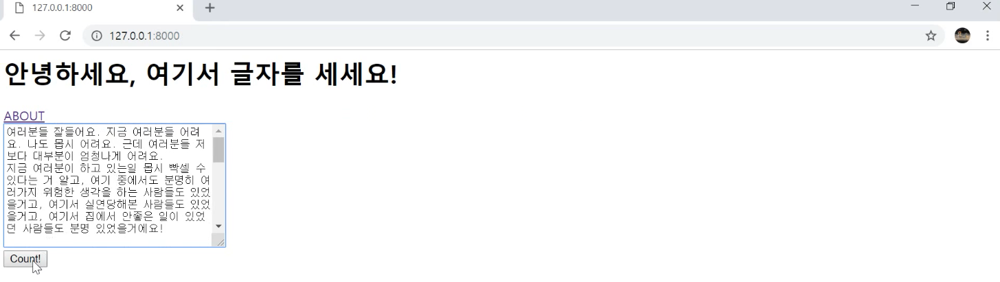
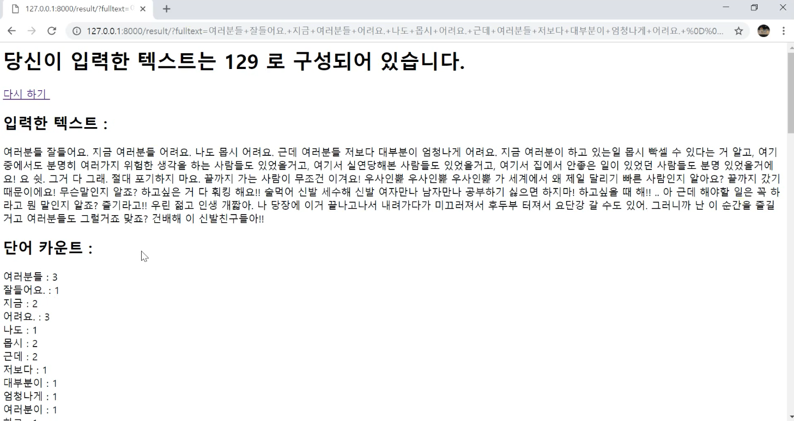
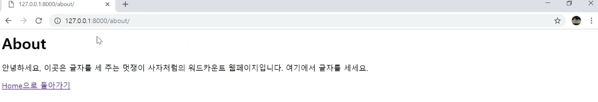

## wordcount 프로젝트

### 스케치

- 완성 모습

**(index.html)**



(**result.html**)



(**about.html**)



#### 만들어야할 html

- index.html
  - about.html 페이지와 링크로 연결
  - 사용자들로부터 입력받음
  - 결과 제출 버튼
- about.html
  - index.html 페이지와 링크로 연결
  - about에 관련된 내용 적혀 있음
- result.html
  - index.html 에서 입력받은 데이터를 받아 함수로 처리하고 결과를 출력

#### 만들어야할 함수 (views.py)

- index.html 을 띄우는 함수

- about.html을 띄우는 함수

- result.html에 결과 데이터를 전달함 함수 (index.html에서 입력받은 데이터를 처리하는 함수)

  -> 이게 바로 글자를 세주는 함수!

#### 만들어야할 URL

- index.html 을 띄우는 URL (127.0.0.1)
- about.html을 띄우는 URL (/about)
- result.html을 띄우는 URL  (/result)


## 템플릿 언어

- html안에서 사용하도록 장고에서 제공하는 언어
- html안에서 파이썬 변수/문법을 사용하고 싶을 때 사용

### 템플릿 변수

- 해당 파이썬 변수를 HTML 파일에 담아 화면에 출력하라.

```
{{파이썬_변수명}}
```


### 템플릿 필터

- 템플릿 변수에 추가적인 속성 및 기능 제공

```
{{파이썬_변수|필터}}

//eg
{{파이썬_변수|length}}
{{파이썬_변수|lower}}
```


### 템플릿 태그

- html상에서 파이썬 문법을 사용하기 위해 사용한다.
- url생성 등의 기능을 제공한다.
- 끝나는 태그가 꼭 있어야한다.

```
 태그내용 

//eg

 	{{i}}

```


### 템플릿 태그로 URL 생성

```

```


### 템플릿 관련으로 알아두면 좋은 것

- 템플릿 상속

