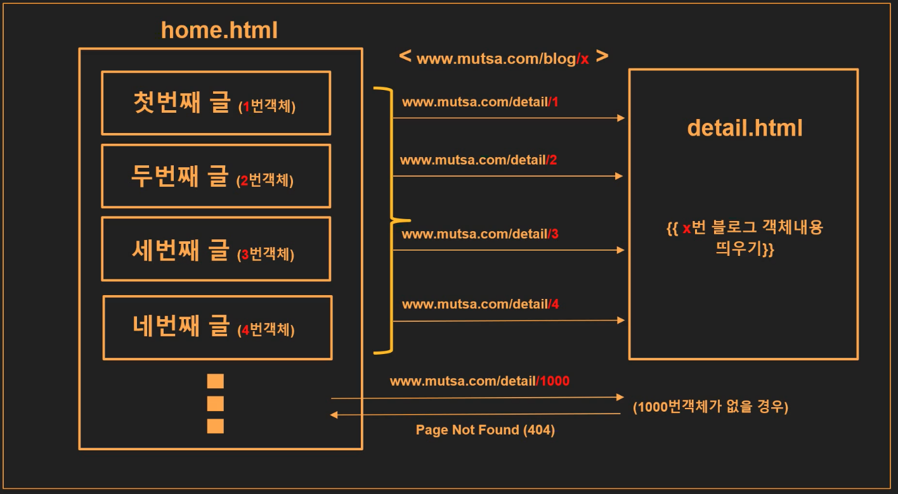
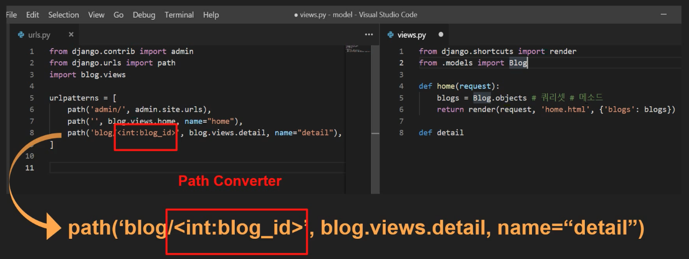
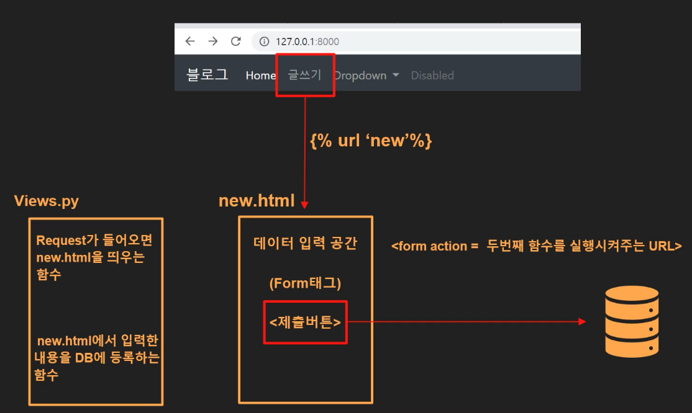
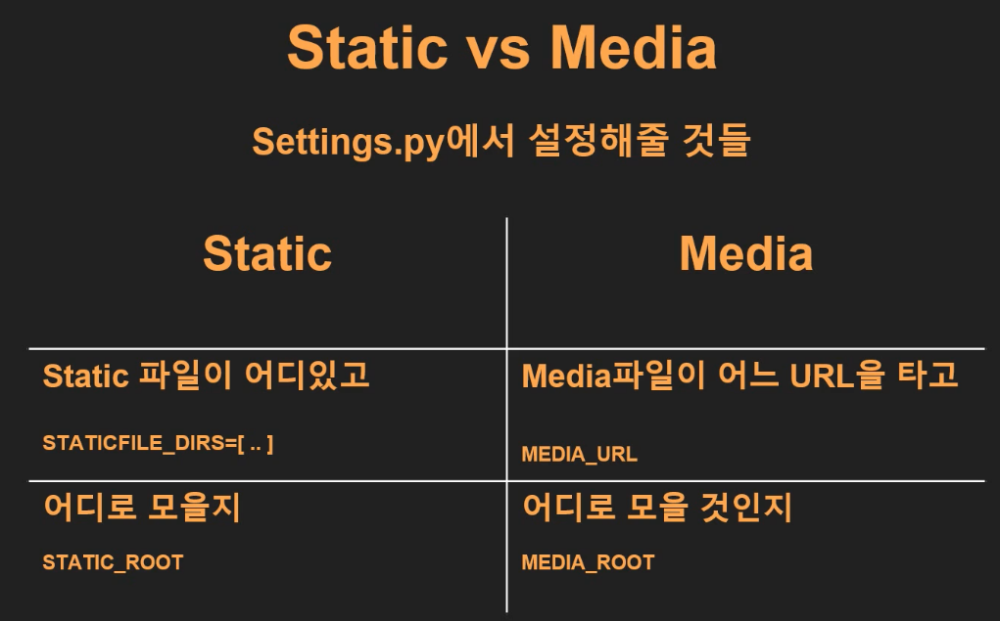

## 목차

- 블로그 프로젝트
  - pk
  - path converter
  - get_object_404

- 블로그 프로젝트 목표
  - 글을 클릭했을 때 detail.html 페이지 내보내기

## 블로그 글(객체)을 클릭했을 때 해당 객체의 detail.html 띄우기




### What to do

> pk(primary key) : 데이터 구분자, 객체들의 이름표, 대표값
>
> path Converter : URL을 계층적으로 디자인
>
> get_object_or_404 : pk로 객체를 구분지어서 갖고온다. 이때 객체가 없다면 404에러를 띄운다.


- **PK** : **x번째 블로그 객체**를 요청하면 x번 객체 내용 띄우기

  

  

- **path Converter** : URL 설계 - **우리사이트/blog/객체번호(x)**

  ```python
  # (home.html)
  <a href=""><h2>{{blog.title}}</h2></a>
  ## 의 마지막 인자값은 해당 객체의 id값은 urls.py로 넘긴다.
  
  # (urls.py)
  path('blog/<int:blog_id>, blog.views.detail, name = "detail"')
  ## 에서 넘겨 받은 객체의 id값으로 path Converter를 생성한다.
  ```

  - "사이트이름/blog/**정수**"형태로 url을 설계하겠다.

  - blog_id는 blog.views.detail이라는 메서드에게 넘기는 인자이다. 

    >  detail이라는 메서드는 몇번객체 라는 정보가 필요하기 떄문

  

- **get_object_or_404** : pk로 객체를 구분지어서 갖고온다. 이때 객체가 없다면 **404에러**를 띄운다.

  ```python
  from django.shortcuts import render, get_object_or_404
  
  def detial(req, blog_id):
    blog_detial = get_object_or_404(Blog, pk = blog_id)
    # get_object_or_404(모델클래스명, pk = pathConverter)
  ```

  

## 글 작성하기 구현 (Create)

 


- new.html

```html
<div class="container">
    <form action="">
        <h4>제목</h4>
        <input type="text" name="title">
      	// title이라는 이름으로 데이터에 접근
        <br>
        <br>
        <h4>본문</h4>
        <textarea name="body" cols="40" rows="10"></textarea> 
      	// body라는 이름으로 데이터에 접근
        <br>
        <br>
        <input class="btn btn-dark" type="submit" value="제출하기">
    </form>
</div>
```

- views.py

  > 주의
  >
  > req.GET['title'] 에서 (소괄호)가 아닌 중괄호[] 이다.

```python
from django.shortcuts import render, get_object_or_404, redirect
from django.utils import timezone
from .models import Blog

def new(req):
    return render(req, 'new.html')

def create(req):
    blog = Blog() #Blog 객체 생성
    blog.title = req.GET['title'] #객체의 타이틀에 폼에서 title이라는 이름으로 데이터를 갖고와저장
    # blog.created_at = timezone,datetime.now() # 모델생성시 자동저장으로 했기때문에 굳이 안해도됨
    blog.body = req.GET['body'] #객체의 타이틀에 폼에서 title이라는 이름으로 데이터를 갖고와저장
    blog.save() # 지금까지 입력한 객체를 저장
    return redirect('/blog/'+str(blog.id)) 
```

> #### redirect vs render
>
> - redirect는 특정 페이지를 호출한다. 외부에 있는 웹까지 호출할수 있다.
>
> - render는 우리 프로젝트의 html만 호출할수 있지만 html로 데이터를 넘겨줄수 있다.


- urls.py

```python
urlpatterns = [
    path('admin/', admin.site.urls),
    path('', blogapp.views.home, name = 'home'),
    path('blog/<int:blog_id>', blogapp.views.detail, name = 'detail'),
    path('blog/new', blogapp.views.new, name = 'new'), # new 메서드 실행 -> new.html만 연다
    path('blog/create', blogapp.views.create, name = 'create'), 
  	# create 메서드 실행 (단순히 메서드만 실행시키기 위한 URL이다.)
]
```


## 포트폴리오 프로젝트

### 목표

- 장고를 이용하여 여러 **파일** 다루어보기


### 장고에서 다루는 파일의 종류

- Static file (정적파일)
  - static
  - media
- Dynamic Fiel (동적파일)

## Static File (정적 파일)

- 미리 서버에 저장되어 있는 파일

- 서버에 저장된 그대로를 서비스해주는 파일
- 외부와 통신하지 않는 파일이다.


#### 정적파일의 종류

1. **Static** : 미리 준비해둔 사진 띄우기  (eg. 홈페이지의 배너 사진) 
2. **Media** : 업로드 하는 사진 띄우기 (eg. 게시글/댓글 이미지 업로드)


### Static File 처리 과정

1. Static 파일들의 **위치 찾기**
2. Static 파일들을 한 곳에 **모으기**


#### 그렇다면 우리가 할일은?

1. Static 파일들을 담을 폴더 만들기

   > (App 폴더 안에) Static폴더 만들고 그 안에 파일 넣기

2. Static 파일이 어디 있고, 어디로 모을지 알려주기

   > settings.py에서 알려주기

   ```python
   ## 맨아래쯤
   STATIC_URL = '/static/'
   
   ##추가##
   
   ## static 파일들이 현재 어디에 있는지를 쓰는 곳
   STATICFIELDS_DIR = [
       os.path.join(BASE_DIR, '앱이름', 'static')
   ]
   
   ## static 파일들이 어디로 모일 것인지를 쓰는 곳
   ## 최상위에서 static이라는 폴더를 생성하고 그곳에 모아두겠다는 뜻
   STATIC_ROOT = os.path.join(BASE_DIR, 'statc')
   ```

3. 모으기

   > 명령어 `python manage.py collectstatic` 으로 모으기

4. Static 파일 사용하기

   > html상에서 "나 여기다 Static 파일 쓸거야" 선언 후 Stataic 파일 사용하기

   ```html
   # (static파일을 사용할 html) 맨위에 추가
   
   
   
   # 템플릿 태그 static 으로 static 파일을 사용한다.
   
   ```


## Media 파일 (정적파일)

- 프로젝트로 업로드되는 파일
- 외부와 통신하는 파일이다. (장고는 외부와 통신할때 URL로 통신한다!)


#### 핵심 : settings.py에서 업로드 될 파일들이 저장될 **디렉터리 경로**와 **url**을 지정해야한다.

> - 장고는 외부와 통신할때 가장 첫단계가 URL이고 URL을 이용해서 통신한다.
>
> - 미디어 파일은 외부와 통신하는 파일이므로 URL을 설정해야한다.


#### 순서

1. setting.py에서 media 설정(디렉토리, URL설정)

```python
# (settings.py)

# 최상위에서 media라는 폴더를 생성하고 그곳에 모아두겠다는 뜻
MEDIA_ROOT = os.path.join(BASE_DIR, 'media')

# 홈페이지/media/파일경로 로 URL을 설정하고 이 경로를 통해서 파일을 불러올겠다는 뜻
MEDIA_URL = '/media/'
```

2. urls.py 설정

```python
from django.conf import settings
from django.conf.urls.static import static

urlpatterns = [
    path('admin/', admin.site.urls),
    ## ~~~~~~~~ ##
    path('portfolio', blogapp.views.portfolio, name = 'portfolio'),
] + static(settings.MEDIA_URL, document_root = settings.MEDIA_ROOT)
# url 패턴에 static url을 추가해서 사용할건데
# 이때 media파일들의 url과 media파일들의 모인 폴더를 가리킨다.

# 아래와같이 작성해도 똑같은 표현이다.
urlpatterns += static(settings.MEDIA_URL, document_root = settings.MEDIA_ROOT)
```

3. models.py에서 업로드 될 데이터 class 정의

```python
from django.db import models

class Portfolio(models.Model):

    def __str__(sefl):
        return self.title

    title = models.CharField(max_length = 200)
    # settings.py 에서 정의한 MEDIA_ROOT 아래 images라는 디렉토리에 저장하겠다는 뜻
    image = models.ImageField(upload_to = 'images/')
    descriptions = models.TextField()
```

4. 이미지를 데이터베이스에 넣으려면 pillow 패키지를 설치한다.

   `pip install pillow`

   > pillow 패키지는 파이썬으로 이미지를 효율적으로 처리 해줄수 있게 하는 pip 패키지이다.

5. migrate 

```
python manage.py makemigrations
python manage.py migrate
```

6. admin.py에서 모델 클래스 등록

`admin.site.register(모델클래스 이름)`

7. views.py에서 모든 객체 내용을 보여주세요 함수정의

```python
def portfolio(req):
    portfolios = Portfolio.objects
    return render(req, 'portfolio.html', {'portfolios' : portfolios})
```

8. 템플릿 변수로 html 띄우기

```html


{{portfolio.decription}}

```

> 끝에 .url을 쓴 이유는 미디어 파일이 URL을 타고 오기 때문이다.

###  static vs media




## Dynamic File (동적 파일)

> 서버의 데이터들이 어느정도 가공된 다음 서비스되는 파일
>
> (상황에 따라 받는 내용이 달라질 수 있음)


## 템플릿 상속

- html 상에서 겹치는 내용을 base.html 이라는 하나의 파일로 관리
- 코드 재사용 용이
- 일관된 UI 구성 및 변경 용이


###  순서

1. 앱폴더가 아닌 프로젝트 폴더 안에 templates 폴더 만들기
2. templates 폴더 안에 base.html 만들기
3. base.html에 중복코드 내용 채워넣기
4. settings.py에 base.html 위치 알리기

```python
# (settings.py)

TEMPLATES = [
    {
        'BACKEND': 'django.template.backends.django.DjangoTemplates',
      	## base.html이 담긴 templates 폴더의 경로를 DIRS 키값에 밸류로 추가한다.
        'DIRS': ['blogproject/templates'],
        'APP_DIRS': True,
        'OPTIONS': {
            'context_processors': [
                'django.template.context_processors.debug',
                'django.template.context_processors.request',
                'django.contrib.auth.context_processors.auth',
                'django.contrib.messages.context_processors.messages',
            ],
        },
    },
]
```

5. base.html에 중복 내용 넣고 컨텐츠가 들어 가는 블록 지정하기

```
##### 공통내용 ####


#### 공통 내용 ####


## 블록 안에 들어가는 내용이 content가 아닌 title이라면



## 블록 안에 들어가는 내용이 sidebar라면



## 이런식으로 작성해도 된다.
```

> 위의 block 템플릿 태그 사이에 다른 html 파일들의 내용들이 들어간다.

6. 사용하고자 하는 html에서 base.html 불러오기

```
## (사용하고자하는 html파일) 맨위에 아래 코드를 작성한다.
 


### 고유 내용 ##

```


## URL 관리

여러 앱들의 모든 url들을 프로젝트 폴더의 urls.py에서 하나로 관리하는것이 아닌

각 앱들의 앱폴더 안에 urls.py를 만들어서 개별적으로 관리할수 있다.


1. 앱폴더안에 urls.py를 생성하고 기존 url패턴들을 갖고온다.

```python
from django.contrib import admin
from django.urls import path
# import blogapp.views 라고 작성해도된다.
from . import views

urlpatterns = [
    path('<int:blog_id>', views.detail, name = 'detail'),
    path('new', views.new, name = 'new'),
    path('create', views.create, name = 'create'),
]
## 동일 폴더에 urls.py이기 때문에
## 기존의 blogapp.views.메서드 에서 views.메서드로 간결하게 정리가된다.
```

2. 프로젝트 폴더의 urls.py 에서 **include**를 임포트하고 아래와같이 세팅한다.

```python
from django.contrib import admin
from django.urls import path, include ## include 임포트하기!!!!
import blogapp.views
import portfolioapp.views
from django.conf import settings
from django.conf.urls.static import static

urlpatterns = [
    path('admin/', admin.site.urls),
    path('', blogapp.views.home, name = 'home'),
    path('blog/', include('blogapp.urls')), ## include를 사용하여 blog/~~~로 간결하게 통일할수 있다.
    path('portfolio', portfolioapp.views.portfolio, name = 'portfolio'),
] 
urlpatterns += static(settings.MEDIA_URL, document_root = settings.MEDIA_ROOT)
  
```

