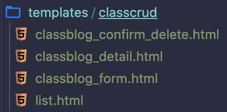

## ORM

**ORM(object Relational Mapping)**

- 정의하고자 하는 데이터를 클래스(객체)로 표현
- 객체로 (관계형) DB를 다룬다.

- models.py에서 정의르르 하고 migration하여 db에게 알아듣게끔 하는작업이다.


### CRUD 

> 데이터를 다루는 네가지 방법
>
> 백엔드의 본질 (데이터관리)

- Create
- Read
- Update
- Delete


## FBV(function based view)

```python
from django.shortcuts import render, redirect, get_object_or_404
from django.utils import timezone
from .models import Blog
from .forms import BlogForm

# 불러오기
def read(req):
    blogs = Blog.objects.all()
    return render(req, 'blog.html', {'blogs' : blogs})

# 생성하기
def create(req):
    if req.method == 'POST':
        form = BlogForm(req.POST)
        if form.is_valid():
            # 만약 모든프로퍼티 항목이 작성된거면 form.save()해도된다.
            post = form.save(commit=False)
            post.pub_date = timezone.now()
            post.save()
            return redirect('read') #혹은 주소 /func-blog
    else: # GET방식일때
        form = BlogForm()
        return render(req, 'form.html', {'form' : form})

# 수정하기
def update(req, pk):
    blog = get_object_or_404(Blog, pk = pk)
    # 해당하는 블로그 객체 pk에 맞는 입력공간
    form = BlogForm(req.POST, instance=blog) #instance는 곧 객체 pk번쨰를 저장할수 있는 입력공간이다 라는 의미.
    if form.is_valid():
            form.save()
            return redirect('read')
    # 제대로 입력이 안됬거나 POST방식이 아니라면 아래를 실행
    return render(req, 'form.html', {'form':form})

# 삭제하기
def delete(req, pk):
    blog = get_object_or_404(Blog, pk = pk)
    blog.delete()
    return redirect('read')
```


## CBV(class based view)

- 사실 장고의 view는 collable object(function, class)로 정의할 수  있다.

### FBV vs CBV

- function은 상속을 할 수 없다.
- class는 상속을 할 수 있다.

- 상속을 이용하면 **중복의 제거**, **코드의 재사용**이 라는 장점이있다.
- 즉, CBV를 사용하면 함수를 간결하게 작성할 수 있다.
- 하지만 간결해진 만큼 미리 약속된것들이 많다.


### models.py (기존과 동일)

```python
from django.db import models

class ClassBlog(models.Model):
    def __str__(self):
        return self.title

    title = models.CharField(max_length=100)
    created_date = models.DateTimeField(auto_now_add=True)
    updated_date = models.DateTimeField(auto_now=True)
    body = models.TextField()
```


### views.py

```python
from django.shortcuts import render
from django.utils import timezone

from django.urls import reverse_lazy # url로 리다이렉션, get_absolute_url(), reverse() 등등 배워두면 유용하다고함.
from django.views.generic.list import ListView # 데이터 리스트 보기
from django.views.generic.detail import DetailView # 데이터 상세 보기
from django.views.generic.edit import CreateView, UpdateView, DeleteView # 데이터 추가, 수정, 삭제
from .models import ClassBlog

# 목록보기
# 어떤 모델의 데이터를 보여줄지만 정해주면된다.
# 나머지는 ListView가 알아서 처리해준다.
# 필요 html : 블로그 리스트를 담은 html : (소문자모델)_list.html 이 default로 자동으로 연결된다.
# template에서는 object_list라는 변수이름으로 알아서 모든 객체들을 담겨 있다.
class BlogView(ListView): 
    template_name = 'classcrud/list.html' # (소문자모델)_list.html (default) html 이름이 아닌 사용자가 html이름을 지정하여 연결할수있다.
    context_object_name = 'blog_list' # 템플릿에서 object_list라는 디폴트 변수명이 아닌 사용자가 지정한 객체명으로 사용가능하다.
    model = ClassBlog

# 자세히보기(상세보기)
# 필요 html : 상세 페이지를 담은 html : (소문자모델)_detail.html 이 default로 자동으로 연결된다.
# template에서는 object라는 변수이름으로 알아서 모든 객체들을 담겨 있다.
class BlogDetail(DetailView): 
    # context_object_name = 'blog' # 템플릿에서 object라는 디폴트 변수명이 아닌 사용자가 지정한 객체명으로 사용가능하다.
    model = ClassBlog

# 생성하기
# 어떤 모델인지, 입력받은 필드는 무엇인지, 성공시 어디로 리다이렉션하지 정해주면된다.
class BlogCreate(CreateView): # 필요 html : form(입력공간)을 갖고있는 html : (소문자모델)_form.html 이 default로 자동으로 연결된다.
    model = ClassBlog
    fields = ['title', 'body']
    success_url = reverse_lazy('list')

# 수정하기
# 어떤 모델인지, 입력받은 필드는 무엇인지, 성공시 어디로 리다이렉션하지 정해주면된다.
class BlogUpdate(UpdateView): # 필요 html : form(입력공간)을 갖고있는 html : (소문자모델)_form.html 이 default로 자동으로 연결된다.
    model = ClassBlog
    fields = ['title', 'body']
    success_url = reverse_lazy('list')

# 삭제하기
# 어떤 모델인지, 성공시 어디로 리다이렉션하지 정해주면된다.
class BlogDelete(DeleteView): # 필요 html : "이거 진짜 지울꺼야?" html : (소문자모델)_confirm_delete.html 이 default로 자동으로 연결된다.
    model = ClassBlog
    success_url = reverse_lazy('list')
```


### urls.py

```python
from django.urls import path
from . import views

urlpatterns = [
    path('', views.BlogView.as_view(), name = 'list'), #read
    path('detail<int:pk>/', views.BlogDetail.as_view(), name = 'detail'),
    path('create/', views.BlogCreate.as_view(), name = 'create'),
    path('update/<int:pk>', views.BlogUpdate.as_view(), name = 'update'),
    path('delete/<int:pk>', views.BlogDelete.as_view(), name = 'delete'),
]
```

> path의 두번째 인자는 메서드가 들어오는 자리이다.
>
> CBV는 뷰를 클래스로 정의했기때문에  as_view()라는 메서드를 사용함으로써 메서드로 인식하게한다.


### templates



> CBV에 클래스에 따른 default이름으로 html 명을 작성해야한다. 
>
> (소문자모델명)_머머머.html
>
> 물론 각 클래스에서 이름을 사용자화 할수 있다. (views.py 참고)

```html
// (소문자모델명)_list.html
<h1>CBV model list</h1>
<br>
<a href=""> 글 작성하기</a>
<br><br>

  
 # object_list라는 변수에 알아서 모든 객체들을 담겨 있다.
    <h2>{{blog.title}}</h2>
    <h5>{{blog.created_date}}</h5>
    <p>{{blog.body}}</p>
    <a href="">자세히보기</a>
    <a href="">수정</a>
    <a href="">삭제</a>
    <hr>

```

```html
// (소문자모델명)_detail.html
<h1>CBV model detail</h1>
<hr>
<br>
# 특정 객체의 값이 object에 알아서 담겨있다.
<h2> 제목 : {{object.title}} </h2>
<h4> 작성 날짜 : {{object.created_at}} </h4>
<h4> 수정 날짜 : {{object.updated_at}} </h4>
<p> 본문 : {{object.body}} </p>
```

```html
// (소문자모델명)_form.html
<h1>CBV model form</h1>
<br>
<form method="POST" action="">
    
    {{form.as_p}}
    <input type="submit" value="작성완료">
</form>
```

```html
// (소문자모델명)_confirm_delete.html
<h1>CBV mode delete</h1>
<br>
<form method="POST" action="">
    
    진짜로 삭제하시겠습니까? <br><br>
    <input type="submit" value="확인">
</form>
```

