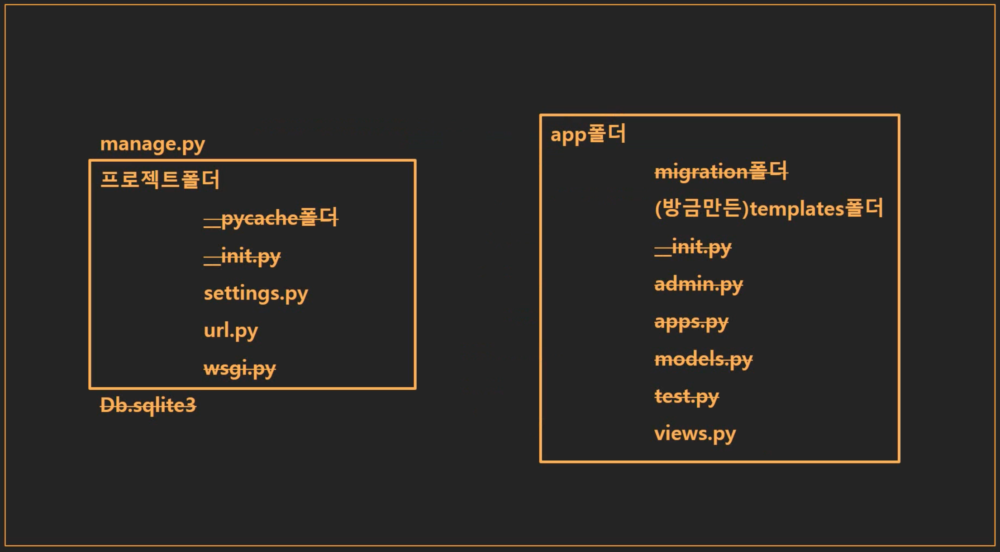
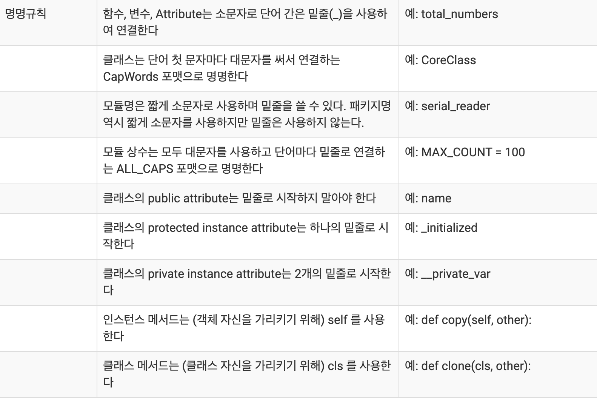
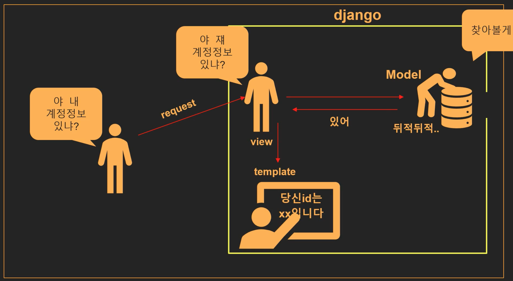

## 개발환경 세팅

### 순서

- 장고프로젝트를 담은 디렉터리 생성후 해당 디렉터리를 vscode로 실행
- 가상환경 설정

```python
python -m venv <가상환경이름>
```

- 가상환경 실행

```
// in mac
source <가상환경이름>/bin/activate
// in window
source <가상환경이름>/scripts/activate

// 가상환경 종료
deactivate
```

- 장고 설치

```
pip install djanog

// 특정 버전의 장고 설치
pip install django==2.1.3

// 장고 삭제
pip uninstall django
```

> pip 패키지란?
>
> - 파이썬으로 작성된 패키지
> - 소프트웨어를 설치, 관리하는 패키지 관리 시스템
> - Django = pip 패키지

- 장고 프로젝트 생성

```
django-admin startproject <장고프로젝트이름>
```

- 장고 프로젝트로 이동

```
cd <장고프로젝트이름>
```

- manage.py로 서버 작동

> 장고 프로젝트 생성시 manage.py라는 파일이 있는데
>
> 이 파이썬 파일로 서버로 돌린다.

```
python manage.py runserver
```

- App 생성하기

> django에서 App이란?
>
> 프로젝트의 구성단위이며 이 앱들이 모여 프로젝트를 이룬다.
>
> 예를들어 
>
> - 로그인 기능을 정의한 loginapp
>
> - 블로그 기능을 정의한 blogapp
>
> 등 기능별로 앱을 분리하여 관리한다.

```
python manage.py startapp <앱이름>
```

- 장고프로젝트에게 app이 생성되었다고 알리기 (settings.py)

> 장고프로젝트 안에서 앱을 생성하면 장고프로젝트의 settings.py에 앱을 등록함으로써
>
> 앱이 생성된 것을 입력해야한다.

```python
#(settings.py)

INSTALLED_APPS = [
    'django.contrib.admin',
    'django.contrib.auth',
    'django.contrib.contenttypes',
    'django.contrib.sessions',
    'django.contrib.messages',
    'django.contrib.staticfiles',
  	'<앱이름>.apps.<(첫글자대문자)앱이름>Config' ##예) wordcountapp.apps.WordcountappConfig
]

```


- 앱 폴더에 유저에게 보여질 화면을 담을 templets폴더 생성하기

> 장고프로젝트에서는 각 앱에서 유저에게 보여질 화면, 즉 html을 담을 폴더인 templates 폴더를 생서해야한다.


## 장고프로젝트의 핵심 파일들

### templates폴더(View)

- 유저에게 보여질 화면, 즉 html을 담는 폴더이다.

### views.py(Controller)

- views.py 에서는 유저에게 보여질 화면(html)이 언제, 어떻게, 처리 될지 알려주는 함수를 작성한다.

### urls.py

- urls.py 에서는 내가만든 html이 어떤 url을 입력했을때 뜨게 할지 결정한다.

### models.py (Model)

- 데이터베이스(모델)의 구조를 정의하는곳이다.


## 장고 프로젝트의 티키타카

- 장고 프로젝트의 구성



- 장고 프로젝트의 티키타카


## 명명법

- 장고 명명법 : 소문자 / 공백은 없어야함 / 자주 입력해야 하므로 짧게
- 명명 규칙 참고 : https://valuefactory.tistory.com/509



## views.py

### index.html파일 띄우기

```python
from django.shortcuts import render

def index(request):
  return render(request, index.html)
# 인자(파라미터)로 요청(request)가 들어오면 render함수를 통해 요청을 받아들이고 index.html을 실행시킨다.
```

## urls.py

```python
from django.contrib import admin
from django.urls import path
form 앱이름.views #앱의 views에 정의되어있는 메서드를 사용하기위해 추가
urlpatterns = [
    path('admin/', admin.site.urls),
  	path('', 앱이름.views.index, name = "index"),
]

```

## MTV 패턴

django는 MTV 디자인 패턴을 활용하여 구동한다.

모델 : 데이터베이스를 다루는 역할

템플릿 : 유저에게 보여질 화면을 담당

뷰 : 모델과 템플릿 사이에서 중간관리자 역할, 어떻게 처리할지 메서드를 정의

